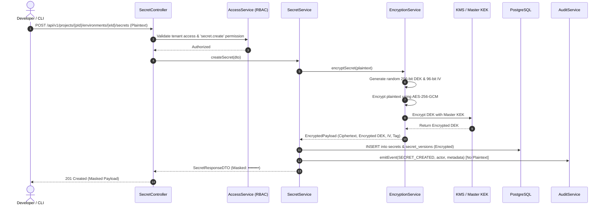
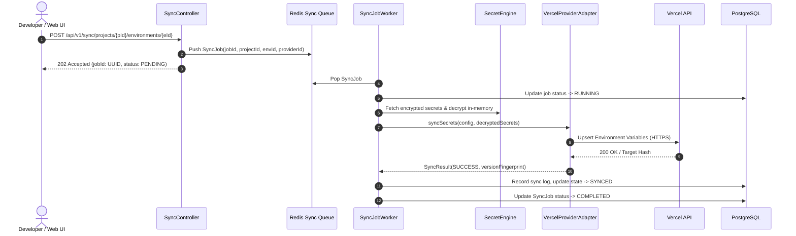
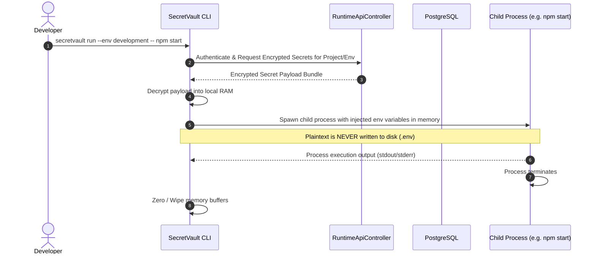

# SecretVault — System Architecture Design

## 1. Architectural Strategy: Modular Monolith

SecretVault is implemented as a **Modular Monolith** using **Spring Boot 3 (Java 21)**. This ensures high velocity, atomic transactional boundaries, type safety, and zero internal network latency for a two-developer team, while enforcing strict domain decoupling.

```mermaid
graph TB
    subgraph ClientLayer["Client & Integration Layer"]
        ReactUI["React Web Dashboard (126 Stitch Screens)"]
        CLI["SecretVault CLI (secretvault run)"]
        VSCode["VS Code Extension"]
        SDK["Client SDKs (Java, Node, Python, Go)"]
        CI["CI/CD Workloads (GitHub Actions / GitLab CI)"]
    end

    subgraph ControlPlane["SecretVault Spring Boot Control Plane (Modular Monolith)"]
        subgraph CorePlatform["Core Platform & Security Domains (Member 1)"]
            Auth["auth (JWT / Sessions / MFA)"]
            Org["organization / workspace"]
            Proj["project / environment"]
            SecEngine["secret (CRUD / Versions / Diff / Rollback)"]
            Crypto["encryption (AES-256-GCM / Envelope / KMS)"]
            Access["access (RBAC / JIT / Reviews)"]
            Audit["audit (Immutable Event Ledger)"]
            SecIntel["security (Risk / Leaks / Blast Radius)"]
        end

        subgraph IntegrationPlatform["Integrations & Dev Platform (Member 2)"]
            Integ["integration (Connections / Mappings)"]
            ProviderSPI["provider (SecretProvider SPI)"]
            SyncEng["sync (Async Queue / Drift / Retries)"]
            Runtime["runtime (In-Memory Process Injection)"]
            Ident["identity (Service Accounts / OIDC)"]
            CICD["cicd (Pipeline Gates)"]
            Tmpl["template (Config Schemas)"]
            Deploy["deployment / health"]
            AIClient["ai (FastAPI Client Boundary)"]
        end
    end

    subgraph DataStorage["Persistence & Cache Layer"]
        Postgres[(PostgreSQL 16\nEncrypted Metadata & Audit)]
        RedisCache[(Redis 7\nQueue, Locks & Rate Limits)]
    end

    subgraph AIServiceLayer["Independent AI Service"]
        FastAPI["Python / FastAPI AI Co-pilot\n(Advisory RCA & Risk Analysis)"]
    end

    subgraph ExternalProviders["Target Infrastructure Providers"]
        AWS["AWS Secrets Manager / SSM"]
        Vercel["Vercel Environment API"]
        Railway["Railway API"]
        GitHub["GitHub Actions Secrets"]
        K8s["Kubernetes Clusters (ESO / CRDs)"]
    end

    ClientLayer -->|REST / TLS 1.3| ControlPlane
    ControlPlane --> Postgres
    ControlPlane --> RedisCache
    AIClient -.->|Sanitized Metadata Only (No Plaintext)| FastAPI
    SyncEng --> ProviderSPI
    ProviderSPI --> AWS
    ProviderSPI --> Vercel
    ProviderSPI --> Railway
    ProviderSPI --> GitHub
    ProviderSPI --> K8s
```

---

## 2. Core Data & Execution Flows

### 2.1 Secret Creation & Envelope Encryption Flow [PLANNED]


---

### 2.2 Asynchronous Synchronization Flow [PLANNED]


---

### 2.3 Developer Runtime Secret Injection Flow (`secretvault run`) [PLANNED]


---

## 3. Authoritative Multi-Tenant Hierarchy [IMPLEMENTED]

SecretVault strictly enforces a 4-tier tenant hierarchy:

```text
Organization (Global Tenant Container)
    │
    └── Workspace (Isolation Boundary & RBAC Context)
            │
            ├── Project (Application / Microservice)
            │      │
            │      ├── Environment (development)
            │      ├── Environment (staging)
            │      └── Environment (production [is_protected = true])
            │
            └── Project
```

### Hierarchy Validation & IDOR Prevention Rules:
1. **Never Trust Client-Supplied Composite IDs:** A client request containing `workspaceId`, `projectId`, and `environmentId` is NEVER trusted implicitly.
2. **Server-Side Ownership Verification:**
   - The backend checks `WorkspaceMembership(workspaceId, userId)` to establish caller authorization and RBAC role.
   - The backend verifies `Project.workspaceId == workspaceId`.
   - The backend verifies `Environment.projectId == projectId`.
3. **Mismatched Path ID Rejection:** If a valid `environmentId` from Project A is queried under `/projects/{projectB}/environments/{envA}`, the server immediately aborts with `404 RESOURCE_NOT_FOUND` (preventing IDOR enumeration).
4. **Cross-Tenant Request Rejection:** Any cross-workspace request is blocked with `403 FORBIDDEN`.

---

## 4. Domain Package Boundaries (`com.secretvault.*`)

| Domain Package | Primary Responsibility | Primary Owner | Status |
|---|---|---|---|
| `common` | Exceptions, RFC-7807 error handler, OpenAPI, Redis, Security filter chain, CorrelationIdFilter | Shared | 🟢 IMPLEMENTED |
| `auth` | User identity, JWT issuance, password reset, sessions, MFA | Member 1 | ⚪ PLANNED |
| `organization` | Organization and workspace lifecycle, tenant membership, invitations | Member 1 | ⚪ PLANNED |
| `project` | Project container lifecycle, health scores, project-level metadata | Member 1 | ⚪ PLANNED |
| `environment` | Dev, Staging, Prod scoping, environment-level policies | Member 1 | ⚪ PLANNED |
| `secret` | Secret CRUD, versioning, masking, rollback, secret diffing, rotation wizard | Member 1 | ⚪ PLANNED |
| `encryption` | AES-256-GCM envelope encryption, DEK generation, KMS/HSM integration | Member 1 | ⚪ PLANNED |
| `access` | Granular RBAC, JIT access requests, approval workflows, access review campaigns | Member 1 | ⚪ PLANNED |
| `audit` | Non-repudiable audit ledger, event emission, compliance logs | Member 1 | ⚪ PLANNED |
| `security` | Risk Center, secret leak scanner, blast radius graph, security policies | Member 1 | ⚪ PLANNED |
| `integration` | Provider connection credentials, platform mapping definitions | Member 2 | ⚪ PLANNED |
| `provider` | `SecretProvider` SPI and adapters (AWS, Vercel, Railway, GitHub, K8s) | Member 2 | ⚪ PLANNED |
| `sync` | Asynchronous sync queue worker, retry engine, drift detection | Member 2 | ⚪ PLANNED |
| `runtime` | SDK runtime secret endpoints, in-memory CLI hydration | Member 2 | ⚪ PLANNED |
| `identity` | Machine identities, Service Accounts, Workload Identity Federation (OIDC) | Member 2 | ⚪ PLANNED |
| `cicd` | CI/CD pipeline gates, PR scanning integration, headless auth | Member 2 | ⚪ PLANNED |
| `template` | Reusable secret templates, configuration generators | Member 2 | ⚪ PLANNED |
| `deployment` | Cloud and self-hosted deployment profiles, cluster connectivity | Member 2 | ⚪ PLANNED |
| `health` | Public health probes, Actuator observability indicators | Member 2 | 🟢 IMPLEMENTED |
| `ai` | Outbound communication boundary to Python/FastAPI AI co-pilot | Member 2 | ⚪ PLANNED |

---

## 4. Future Microservice Extraction Strategy

Extracting a domain into a standalone microservice requires a formal Architecture Decision Record (ADR). Extraction candidate priorities:
1. `ai-service` (Implemented as independent Python/FastAPI service from day one).
2. `sync-worker` (Extractable if asynchronous provider rate-limiting demands separate scale-out).
3. `auth-service` (Extractable for high-volume enterprise SSO / SCIM token validation).
