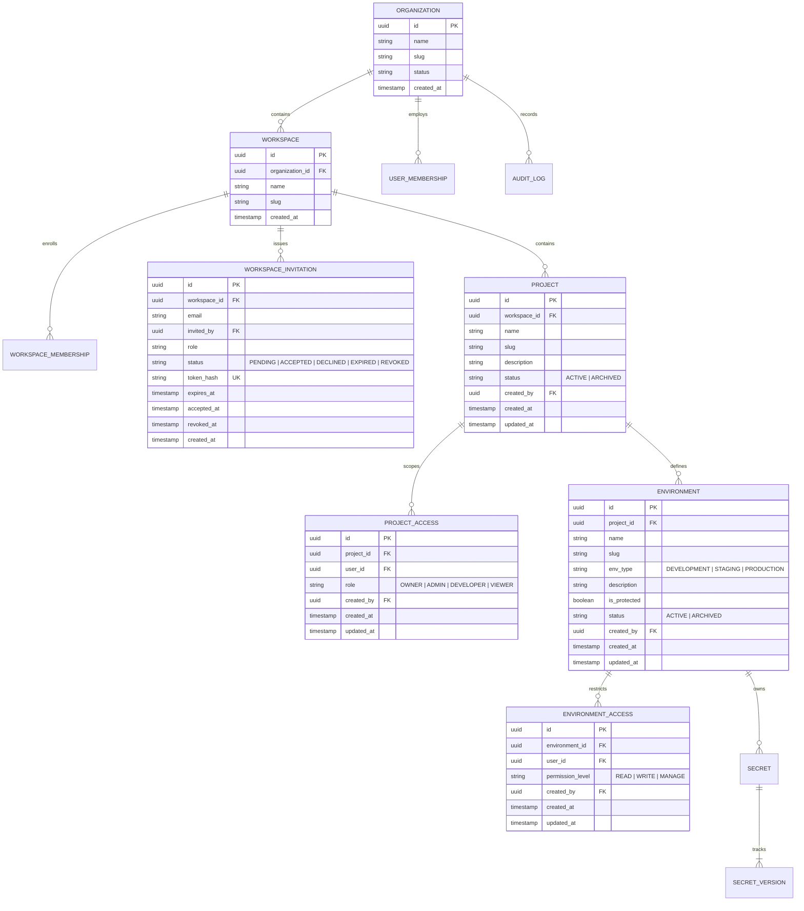

# SecretVault — Database Architecture & Schema Design

## 1. Storage Overview

- **Primary Relational Store:** PostgreSQL 16
- **Schema Management:** Flyway Migrations (`backend/src/main/resources/db/migration/`)
- **Cache & Ephemeral Queue:** Redis 7

---

## 2. Core Relational Schema Principles

1. **Zero Plaintext Secrets:** Plaintext secret values MUST NEVER be persisted in PostgreSQL. Secret columns store encrypted ciphertext bytes, encrypted DEK tokens, initialization vectors (IV), and auth tags.
2. **Flyway Migration Standards:**
   - Every schema mutation requires an incremental migration: `V<Version>__<Description>.sql`.
   - Never alter, remove, or rename an applied Flyway migration.
   - Migrations must be strictly backward-compatible.
3. **Multi-Tenancy Indexing:**
   - Every tenant-scoped entity (`projects`, `environments`, `secrets`, `audit_logs`) MUST contain `organization_id` and `workspace_id`.
   - Composite indexes must be applied: `(organization_id, id)` and `(organization_id, created_at)`.

### Applied Flyway Migrations:
- `V1__init_baseline.sql` — Baseline initialization
- `V2__auth_and_workspaces_schema.sql` — Users, organizations, workspaces, memberships, and refresh tokens
- `V3__projects_and_environments_schema.sql` — Projects and environments tables with UUID primary keys, foreign keys, unique slug constraints, and indexes
- `V4__workspace_invitations_and_access_scoping.sql` — `workspace_invitations`, `project_access`, and `environment_access` tables for fine-grained multi-tier RBAC and invitation workflows

---

## 3. Conceptual Entity-Relationship Model [IMPLEMENTED]

---

## 4. Encryption Metadata Columns (Phase 3 Planned)

Every secret version table record stores cryptographic envelope components:

| Column Name | Type | Purpose |
|---|---|---|
| `encrypted_payload` | `BYTEA` | Ciphertext produced by AES-256-GCM |
| `encrypted_dek` | `BYTEA` | Unique Data Encryption Key encrypted with Master KEK |
| `iv_nonce` | `BYTEA` | 96-bit unique Initialization Vector (IV) |
| `auth_tag` | `BYTEA` | 128-bit authentication tag validating ciphertext integrity |
| `kms_key_id` | `VARCHAR(255)` | Identifier or ARN of the Key Encryption Key (KEK) |

---

## 5. Audit Log Retention & Immutability

- `audit_logs` records are **append-only**.
- PostgreSQL permissions for application users must omit `UPDATE` and `DELETE` privileges on `audit_logs`.
- Minimum retention: 365 days for standard tiers; 7 years for enterprise compliance tiers.

---

## 6. Redis Usage & TTL Policy

| Key Pattern | Purpose | TTL |
|---|---|---|
| `ratelimit:{tenant}:{ip}` | API Rate limiting (sliding window) | 60 seconds |
| `sync:lock:{env_id}:{provider_id}` | Distributed mutex for external provider synchronization | 5 minutes |
| `jit:grant:{grant_id}` | Active ephemeral Just-In-Time access grant token | 1–8 hours |
| `token:blacklist:{jti}` | Revoked JWT tokens | Remaining token lifespan |
