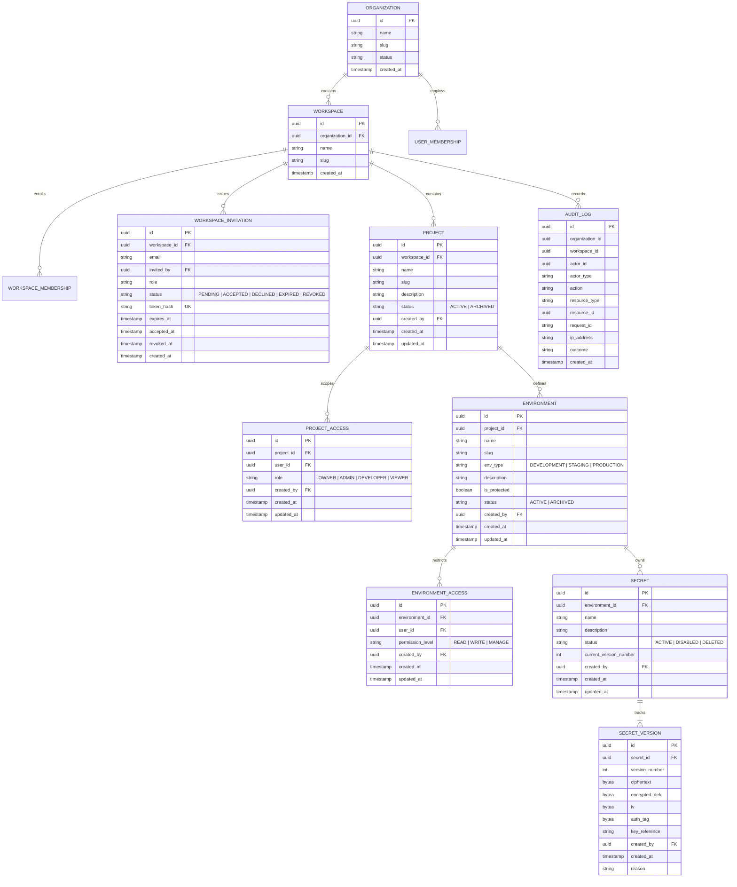

# SecretVault — Database Architecture & Schema Design

## 1. Storage Overview

- **Primary Relational Store:** PostgreSQL 16
- **Schema Management:** Flyway Migrations (`backend/src/main/resources/db/migration/`)
- **Cache & Ephemeral Queue:** Redis 7

---

## 2. Core Relational Schema Principles

1. **Zero Plaintext Secrets:** Plaintext secret values MUST NEVER be persisted in PostgreSQL. Secret columns store encrypted ciphertext bytes, encrypted DEK tokens, initialization vectors (IV), and auth tags.
2. **Flyway Migration Standards:**
   - Every schema mutation requires an incremental migration: `V<Version>__<Description>.sql`.
   - Never alter, remove, or rename an applied Flyway migration.
   - Migrations must be strictly backward-compatible.
3. **Multi-Tenancy Indexing:**
   - Every tenant-scoped entity (`projects`, `environments`, `secrets`, `audit_logs`) MUST contain `organization_id` and `workspace_id`.
   - Composite indexes must be applied: `(organization_id, id)` and `(organization_id, created_at)`.

### Applied Flyway Migrations:
- `V1__init_baseline.sql` — Baseline initialization
- `V2__auth_and_workspaces_schema.sql` — Users, organizations, workspaces, memberships, and refresh tokens
- `V3__projects_and_environments_schema.sql` — Projects and environments tables with UUID primary keys, foreign keys, unique slug constraints, and indexes
- `V4__workspace_invitations_and_access_scoping.sql` — `workspace_invitations`, `project_access`, and `environment_access` tables for fine-grained multi-tier RBAC and invitation workflows
- `V5__core_secret_management_schema.sql` — `secrets`, `secret_versions`, and `audit_logs` tables with envelope encryption columns, monotonic version constraints, foreign keys, and indexes
- `V6__versioning_branching_and_promotion_schema.sql` — `secret_branches`, `secret_version_tags`, and lineage/branching foreign keys on `secret_versions` for version control and cross-environment promotion
- `V7__access_control_and_jit_schema.sql` — `access_grants`, `jit_access_requests`, `access_review_campaigns`, and `access_review_items` for granular access control, dual-custody JIT elevation, and periodic certification campaigns

---

## 3. Conceptual Entity-Relationship Model [IMPLEMENTED]

---

## 4. Encryption Metadata Columns & Table Schemas [IMPLEMENTED]

### 4.1 `secrets` Table
Stores high-level metadata and active version pointers without holding secret values.
- `id` (UUID, PK)
- `environment_id` (UUID, FK -> `environments(id) ON DELETE RESTRICT`)
- `name` (VARCHAR(255), pattern `^[A-Z0-9][A-Z0-9_.-]*$`)
- `description` (TEXT)
- `status` (VARCHAR(32), `ACTIVE` | `DISABLED` | `DELETED`)
- `current_version_number` (INTEGER, default 1)
- `created_by` (UUID, FK -> `users(id)`)
- `created_at`, `updated_at` (TIMESTAMPTZ)
- Constraints: `UNIQUE(environment_id, name)`
- Indexes: `idx_secrets_env_status (environment_id, status)`, `idx_secrets_name (name)`

### 4.2 `secret_versions` Table
Immutable cryptographic ledger storing envelope-encrypted payloads.
- `id` (UUID, PK)
- `secret_id` (UUID, FK -> `secrets(id) ON DELETE CASCADE`)
- `version_number` (INTEGER NOT NULL)
- `ciphertext` (`BYTEA` NOT NULL, AES-256-GCM ciphertext)
- `encrypted_dek` (`BYTEA` NOT NULL, DEK wrapped with Master KEK)
- `iv` (`BYTEA` NOT NULL, 96-bit random nonce)
- `auth_tag` (`BYTEA` NOT NULL, 128-bit authentication tag)
- `key_reference` (VARCHAR(255) NOT NULL, KMS / KEK identifier)
- `created_by` (UUID, FK -> `users(id)`)
- `created_at` (TIMESTAMPTZ NOT NULL)
- `reason` (TEXT, optional audit rotation note)
- `version_type` (VARCHAR(32) NOT NULL, default `VALUE_UPDATE` — `INITIAL`, `VALUE_UPDATE`, `ROLLBACK`, `PROMOTION`, `BRANCH_COMMIT`, `MERGE`)
- `source_version_id` (UUID, FK -> `secret_versions(id)`)
- `source_secret_id` (UUID, FK -> `secrets(id)`)
- `source_environment_id` (UUID, FK -> `environments(id)`)
- `branch_id` (UUID, FK -> `secret_branches(id)`)
- Constraints: `UNIQUE(secret_id, version_number)`
- Indexes: `idx_secret_versions_secret_ver (secret_id, version_number DESC)`, `idx_secret_versions_branch (branch_id)`

### 4.3 `secret_branches` Table [IMPLEMENTED]
Isolated feature and experimentation branches for secrets.
- `id` (UUID, PK)
- `secret_id` (UUID NOT NULL, FK -> `secrets(id)`)
- `name` (VARCHAR(255) NOT NULL)
- `description` (TEXT)
- `base_version_id` (UUID, FK -> `secret_versions(id)`)
- `head_version_id` (UUID, FK -> `secret_versions(id)`)
- `status` (VARCHAR(32) NOT NULL, default `ACTIVE` — `ACTIVE`, `MERGED`, `ARCHIVED`)
- `created_by` (UUID, FK -> `users(id)`)
- `created_at`, `updated_at` (TIMESTAMPTZ NOT NULL)
- `merged_at` (TIMESTAMPTZ), `merged_by` (UUID)
- Constraints: `UNIQUE(secret_id, name)`
- Indexes: `idx_secret_branches_secret (secret_id, status)`

### 4.4 `secret_version_tags` Table [IMPLEMENTED]
Immutable semantic metadata tags attached to historical versions (e.g. `production`, `stable`, `release-2026.09`).
- `id` (UUID, PK)
- `secret_version_id` (UUID NOT NULL, FK -> `secret_versions(id)`)
- `name` (VARCHAR(64) NOT NULL)
- `created_by` (UUID, FK -> `users(id)`)
- `created_at` (TIMESTAMPTZ NOT NULL)
- Constraints: `UNIQUE(secret_version_id, name)`
- Indexes: `idx_secret_version_tags_version (secret_version_id)`

### 4.5 `audit_logs` Table
Append-only immutable record of all security-sensitive actions.
- `id` (UUID, PK)
- `organization_id`, `workspace_id` (UUID)
- `actor_id` (UUID, actor user ID)
- `actor_type` (VARCHAR(32), e.g. `USER`, `SERVICE_ACCOUNT`)
- `action` (VARCHAR(64), e.g. `SECRET_CREATED`, `SECRET_REVEALED`, `SECRET_VALUE_UPDATED`, `SECRET_DELETED`)
- `resource_type` (VARCHAR(64), e.g. `SECRET`, `ENVIRONMENT`)
- `resource_id` (UUID, target resource ID)
- `request_id` (VARCHAR(128), correlation trace ID)
- `ip_address` (VARCHAR(64), client IP)
- `outcome` (VARCHAR(32), `SUCCESS` | `FAILURE`)
- `created_at` (TIMESTAMPTZ NOT NULL)
- Indexes: `idx_audit_workspace_created (workspace_id, created_at DESC)`, `idx_audit_resource (resource_type, resource_id)`

---

## 5. Audit Log Retention & Immutability

- `audit_logs` records are **append-only**.
- PostgreSQL permissions for application users must omit `UPDATE` and `DELETE` privileges on `audit_logs`.
- Minimum retention: 365 days for standard tiers; 7 years for enterprise compliance tiers.

---

## 6. Redis Usage & TTL Policy

| Key Pattern | Purpose | TTL |
|---|---|---|
| `ratelimit:{tenant}:{ip}` | API Rate limiting (sliding window) | 60 seconds |
| `sync:lock:{env_id}:{provider_id}` | Distributed mutex for external provider synchronization | 5 minutes |
| `jit:grant:{grant_id}` | Active ephemeral Just-In-Time access grant token | 1–8 hours |
| `token:blacklist:{jti}` | Revoked JWT tokens | Remaining token lifespan |
