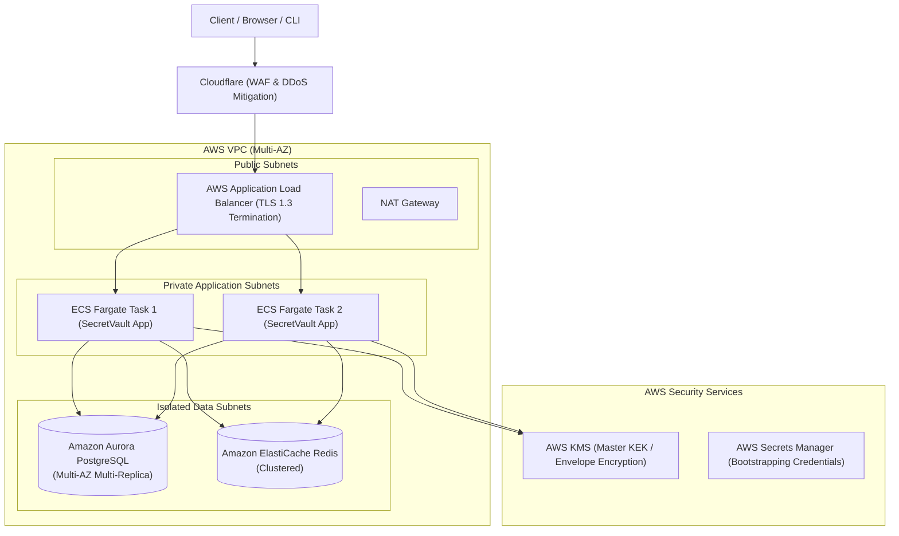

# SecretVault — Deployment Guide & Production Topology

## 1. Local Development (Docker Compose) [IMPLEMENTED]

The root [docker-compose.yml](file:///d:/CodePlayground/JAVA%20SpringBoot/SecureVault/docker-compose.yml) spins up the complete local developer environment:

```bash
# Start PostgreSQL 16, Redis 7, and SecretVault Backend
docker compose up -d

# Verify container health
docker compose ps

# View backend application logs
docker compose logs -f backend
```

---

## 2. Production AWS Target Architecture [PLANNED]



---

## 3. Production Hardening Requirements

1. **Envelope Encryption:** Production deployments must use hardware-backed KMS (AWS KMS or GCP Cloud KMS).
2. **Database Resilience:** Multi-AZ Amazon Aurora PostgreSQL with automated snapshot backups (35-day retention) and read replicas.
3. **Redis High Availability:** Multi-AZ Amazon ElastiCache Redis cluster with in-transit and at-rest encryption.
4. **Zero-Trust Network:** Application containers run in private VPC subnets; database is strictly non-routable from the public internet.
5. **TLS 1.3:** Enforce TLS 1.3 with strict cipher suites across all public endpoints.
