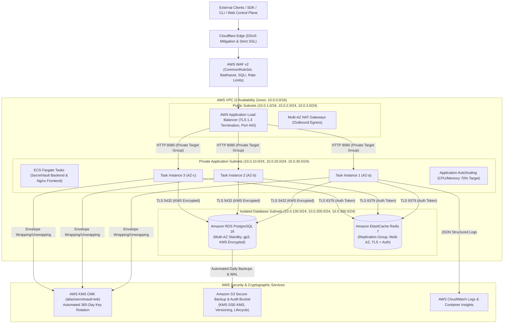

# SecretVault — Production Deployment & Cloud Platform Guide

## 1. Local Development (Docker Compose) [IMPLEMENTED]

The root [docker-compose.yml](file:///d:/CodePlayground/JAVA%20SpringBoot/SecureVault/docker-compose.yml) spins up the complete local developer environment:

```bash
# Start PostgreSQL 16, Redis 7, and SecretVault Backend
docker compose up -d

# Verify container health
docker compose ps

# View backend application logs
docker compose logs -f backend
```

Production-grade container testing can be run with [docker-compose.prod.yml](file:///d:/CodePlayground/JAVA%20SpringBoot/SecureVault/infrastructure/docker/docker-compose.prod.yml):
```bash
docker compose -f infrastructure/docker/docker-compose.prod.yml up -d
```

---

## 2. Production AWS Infrastructure Topology [IMPLEMENTED — PHASE 16]

SecretVault's enterprise cloud architecture is fully codified under [infrastructure/terraform/aws](file:///d:/CodePlayground/JAVA%20SpringBoot/SecureVault/infrastructure/terraform/aws).


```mermaid
graph TB
    InternetUsers["External Clients / SDK / CLI / Web Control Plane"] --> CloudflareEdge["Cloudflare Edge (DDoS Mitigation & Strict SSL)"]
    CloudflareEdge --> AWSWAF["AWS WAF v2 (CommonRuleSet, BadInputs, SQLi, Rate Limits)"]
    AWSWAF --> ALB["AWS Application Load Balancer (TLS 1.3 Termination, Port 443)"]
    
    subgraph AWSVPC["AWS VPC (3 Availability Zones: 10.0.0.0/16)"]
        subgraph PublicSubnets["Public Subnets (10.0.1.0/24, 10.0.2.0/24, 10.0.3.0/24)"]
            ALB
            NATGateways["Multi-AZ NAT Gateways (Outbound Egress)"]
        end

        subgraph PrivateAppSubnets["Private Application Subnets (10.0.10.0/24, 10.0.20.0/24, 10.0.30.0/24)"]
            ECS_Service["ECS Fargate Tasks (SecretVault Backend & Nginx Frontend)"]
            ECS_Task1["Task Instance 1 (AZ-a)"]
            ECS_Task2["Task Instance 2 (AZ-b)"]
            ECS_Task3["Task Instance 3 (AZ-c)"]
            AutoScaler["Application AutoScaling (CPU/Memory 70% Target)"]
        end

        subgraph IsolatedDataSubnets["Isolated Database Subnets (10.0.100.0/24, 10.0.200.0/24, 10.0.300.0/24)"]
            RDSPostgres[("Amazon RDS PostgreSQL 16\n(Multi-AZ Standby, gp3, KMS Encrypted)")]
            ElastiCacheRedis[("Amazon ElastiCache Redis 7\n(Replication Group, Multi-AZ, TLS + Auth)")]
        end
    end

    subgraph AWSSecurity["AWS Security & Cryptographic Services"]
        AWSKMS["AWS KMS CMK (alias/secretvault-kek)\nAutomated 365-Day Key Rotation"]
        S3BackupBucket["Amazon S3 Secure Backup & Audit Bucket\n(KMS SSE-KMS, Versioning, Lifecycle)"]
        CloudWatchLogs["AWS CloudWatch Logs & Container Insights"]
    end

    ALB -->|"HTTP 8080 (Private Target Group)"| ECS_Task1
    ALB -->|"HTTP 8080 (Private Target Group)"| ECS_Task2
    ALB -->|"HTTP 8080 (Private Target Group)"| ECS_Task3

    ECS_Task1 -->|"TLS 5432 (KMS Encrypted)"| RDSPostgres
    ECS_Task2 -->|"TLS 5432 (KMS Encrypted)"| RDSPostgres
    ECS_Task3 -->|"TLS 5432 (KMS Encrypted)"| RDSPostgres

    ECS_Task1 -->|"TLS 6379 (Auth Token)"| ElastiCacheRedis
    ECS_Task2 -->|"TLS 6379 (Auth Token)"| ElastiCacheRedis
    ECS_Task3 -->|"TLS 6379 (Auth Token)"| ElastiCacheRedis

    ECS_Task1 -->|"Envelope Wrapping/Unwrapping"| AWSKMS
    ECS_Task2 -->|"Envelope Wrapping/Unwrapping"| AWSKMS
    ECS_Task3 -->|"Envelope Wrapping/Unwrapping"| AWSKMS

    ECS_Task1 -->|"JSON Structured Logs"| CloudWatchLogs
    RDSPostgres -->|"Automated Daily Backups & WAL"| S3BackupBucket
```

---

## 3. Production Hardening Implementation Details

### A. Network Isolation & Least-Privilege Security Groups
- **VPC Subnet Tiering**:
  - `Public Subnets`: Internet-facing ALB and NAT Gateways.
  - `Private Application Subnets`: ECS Fargate tasks with no public IP. Outbound internet routed through NAT Gateways for external provider integrations (AWS, Vault, GitHub, Doppler).
  - `Isolated Data Subnets`: Amazon RDS PostgreSQL and Amazon ElastiCache Redis. Completely non-routable from the public internet (no IGW, no NAT route).
- **Security Group Chaining**:
  - `ALB SG`: Ingress 443 from `0.0.0.0/0` (or Cloudflare CIDR prefix lists).
  - `ECS SG`: Ingress 8080 strictly from `ALB SG`.
  - `RDS SG`: Ingress 5432 strictly from `ECS SG`.
  - `ElastiCache SG`: Ingress 6379 strictly from `ECS SG`.
  - `VPC Flow Logs`: Active across all network interfaces, published to CloudWatch with KMS encryption.

### B. Hardware-Backed KMS Master Key (KEK)
- AWS KMS Customer Managed Key (CMK) configured with 365-day automated key rotation.
- Application uses [`AwsKmsKeyProvider`](file:///d:/CodePlayground/JAVA%20SpringBoot/SecureVault/backend/src/main/java/com/secretvault/encryption/kms/AwsKmsKeyProvider.java) for envelope encryption:
  - Data Encryption Keys (DEKs) are generated and wrapped via AWS KMS API (`kms:Encrypt` / `kms:Decrypt`).
  - Plaintext DEK buffers in JVM memory are immediately wiped (`Arrays.fill(raw, (byte) 0)`).
  - Master key never leaves AWS KMS hardware security modules.

### C. Database High Availability & Automated Backup
- **Engine**: PostgreSQL 16 on Amazon RDS (Multi-AZ synchronous replication across 2 AZs).
- **Storage**: gp3 with KMS encryption at rest.
- **Connection Security**: `rds.force_ssl = 1` enforced via custom parameter group.
- **Hikari Connection Pool**: Optimized pool sizing (maximum 25 connections per instance, leak detection threshold 30s, connection timeout 5s).
- **Automated Backup & DR**:
  - 30-day continuous point-in-time recovery (PITR) window.
  - S3 encrypted export with SHA-256 integrity validation scripts ([infrastructure/scripts/backup_postgres.sh](file:///d:/CodePlayground/JAVA%20SpringBoot/SecureVault/infrastructure/scripts/backup_postgres.sh) and [infrastructure/scripts/restore_postgres.sh](file:///d:/CodePlayground/JAVA%20SpringBoot/SecureVault/infrastructure/scripts/restore_postgres.sh)).

### D. Redis High Availability & Fail-Closed Security
- **Engine**: Redis 7 on Amazon ElastiCache (Replication Group with Multi-AZ automatic failover).
- **Encryption**: In-transit TLS encryption and at-rest KMS encryption.
- **Authentication**: Redis AUTH token enforced on all connections.
- **Operational Resilience**: Security rate limiting and state storage explicitly configure fail-closed behavior (`secretvault.redis.rate-limit.fail-open: false`).

### E. Zero-Downtime Rolling Deployments
- ECS Fargate rolling deployment configuration:
  - `minimum_healthy_percent = 100`
  - `maximum_percent = 200`
- ALB health checks target `/actuator/health/readiness` with 10s interval and 3 consecutive healthy thresholds before routing user traffic.
- Graceful shutdown timeout configured to 30s allowing in-flight requests and secret sync outbox transactions to complete.

---

## 4. Terraform Deployment Walkthrough

### Prerequisites
- Terraform CLI >= 1.7.0
- AWS CLI configured with administrator or CI/CD provisioning role

### Step-by-Step Provisioning
```bash
# 1. Navigate to Terraform AWS module
cd infrastructure/terraform/aws

# 2. Copy variables template and configure your domain & certificate
cp terraform.tfvars.example terraform.tfvars
# Edit terraform.tfvars with your environment, domain_name, and certificate_arn

# 3. Initialize Terraform providers and backend
terraform init

# 4. Plan the infrastructure rollout
terraform plan -out=tfplan

# 5. Apply the infrastructure
terraform apply tfplan
```

### GitHub Actions OIDC CI/CD (Zero Static AWS Keys)
The deployment workflow ([.github/workflows/deploy-aws.yml](file:///d:/CodePlayground/JAVA%20SpringBoot/SecureVault/.github/workflows/deploy-aws.yml)) assumes the IAM role provisioned by `modules/iam` via GitHub's OIDC identity provider (`token.actions.githubusercontent.com`), ensuring no permanent `AWS_ACCESS_KEY_ID` or `AWS_SECRET_ACCESS_KEY` are stored in repository secrets.

---

## 5. Operational Health & Maintenance Management

- **Maintenance Mode API**:
  - `GET /api/v1/system/maintenance` — Read current maintenance state.
  - `POST /api/v1/system/maintenance/enable` — Transition platform to maintenance mode (HTTP 503 on mutations, admin bypass supported).
  - `POST /api/v1/system/maintenance/disable` — Restore standard production operation.
- **System Health & SLO Evaluation**:
  - `GET /api/v1/system/health/score` — Real-time health score (0-100) and SLO status for PostgreSQL, Redis, KMS, and background sync workers.
