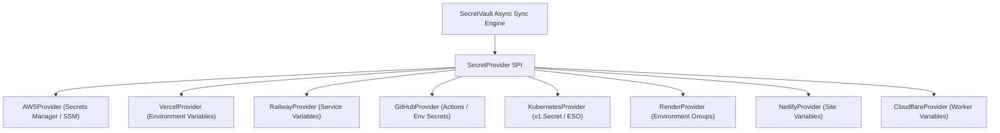

# SecretVault — Integrations & Provider Adapter System

## 1. Provider Adapter Architecture

SecretVault integrates with cloud hosting, CI/CD, and container infrastructure via a clean **Provider Adapter Pattern**. Provider SDKs and API calls are strictly encapsulated behind the `SecretProvider` Service Provider Interface (SPI).



---

## 2. `SecretProvider` SPI Specification [PLANNED]

```java
package com.secretvault.provider.spi;

import java.util.List;

public interface SecretProvider {
    ProviderType getProviderType();
    
    ValidationResult testConnection(ProviderConnectionConfig config);
    DiscoveryResult discoverResources(ProviderConnectionConfig config);
    List<ProviderSecretSummary> listSecrets(ProviderConnectionConfig config, MappingContext context);
    
    SyncResult syncSecrets(
        ProviderConnectionConfig config,
        List<DecryptedSecretEntry> secrets,
        MappingContext context
    );
    
    void createOrUpdateSecret(
        ProviderConnectionConfig config,
        DecryptedSecretEntry secret,
        MappingContext context
    );
    
    void deleteSecret(
        ProviderConnectionConfig config,
        String secretKey,
        MappingContext context
    );
    
    ProviderHealth getStatus(ProviderConnectionConfig config);
}
```

---

## 3. Failure Classification & Retry Policies

| Failure Type | Examples | Handling Strategy |
|---|---|---|
| **Transient** | 503 Service Unavailable, 429 Rate Limit, Socket Timeout | Exponential backoff retry (e.g. 1s, 2s, 4s, 8s up to 5 attempts). |
| **Permanent / Configuration** | 401 Bad API Key, 403 Missing Permission, 404 Project Not Found | Abort immediately, record failure in Sync Center, alert project owner. |
| **Partial Failure** | 4 out of 5 secrets synchronized successfully | Record partial sync status, mark specific failed secret keys, schedule targeted retry. |

---

## 4. Drift Detection & Non-Plaintext Comparison

SecretVault assesses drift between desired local state and remote provider state without requiring providers to expose plaintext values:
1. **Hash / Fingerprint Comparison:** Compare SHA-256 HMAC of secret value against provider metadata or ETag.
2. **Version & Timestamp Tracking:** Compare provider version identifiers with SecretVault version ledger.
3. **Presence Checks:** Verify whether key exists on remote provider.

### Drift States:
- `SYNCED` — Remote metadata matches current SecretVault version.
- `DRIFTED` — Remote version/hash differs from SecretVault desired state.
- `MISSING` — Key defined in SecretVault is absent on provider.
- `UNKNOWN` — Target provider API error or unverified state.
