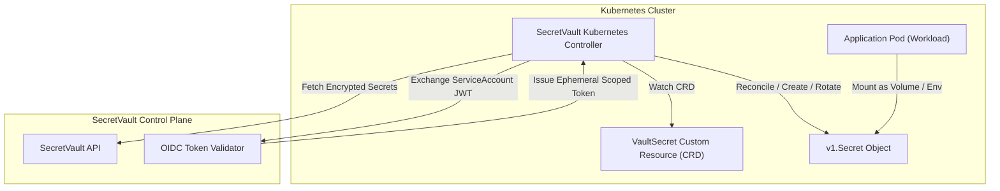

# SecretVault — Kubernetes & Cloud-Native Integration

## 1. Overview & Strategy

SecretVault integrates with Kubernetes through two distinct, complementary mechanisms:
1. **External Secrets Operator (ESO) Integration:** SecretVault acts as an external `SecretStore` provider to sync secrets directly into native Kubernetes `v1.Secret` resources.
2. **SecretVault Kubernetes Operator & Sidecar [PLANNED]:** Injects secrets directly into pod memory volumes without writing unencrypted `v1.Secret` objects to `etcd`.

---

## 2. Kubernetes Operator Architecture [PLANNED]

---

## 3. Workload Identity & Zero Static Credentials

Kubernetes workloads authenticate without static long-lived credentials:
1. The SecretVault Operator presents its **Kubernetes Projected Service Account Token (OIDC JWT)**.
2. SecretVault verifies the JWT signature against the cluster's public OIDC discovery endpoint (`/.well-known/openid-configuration`).
3. SecretVault maps the cluster ID, namespace, and service account name to authorized project/environment policies.
4. Ephemeral, short-lived tokens are issued for the duration of the reconciliation loop.
