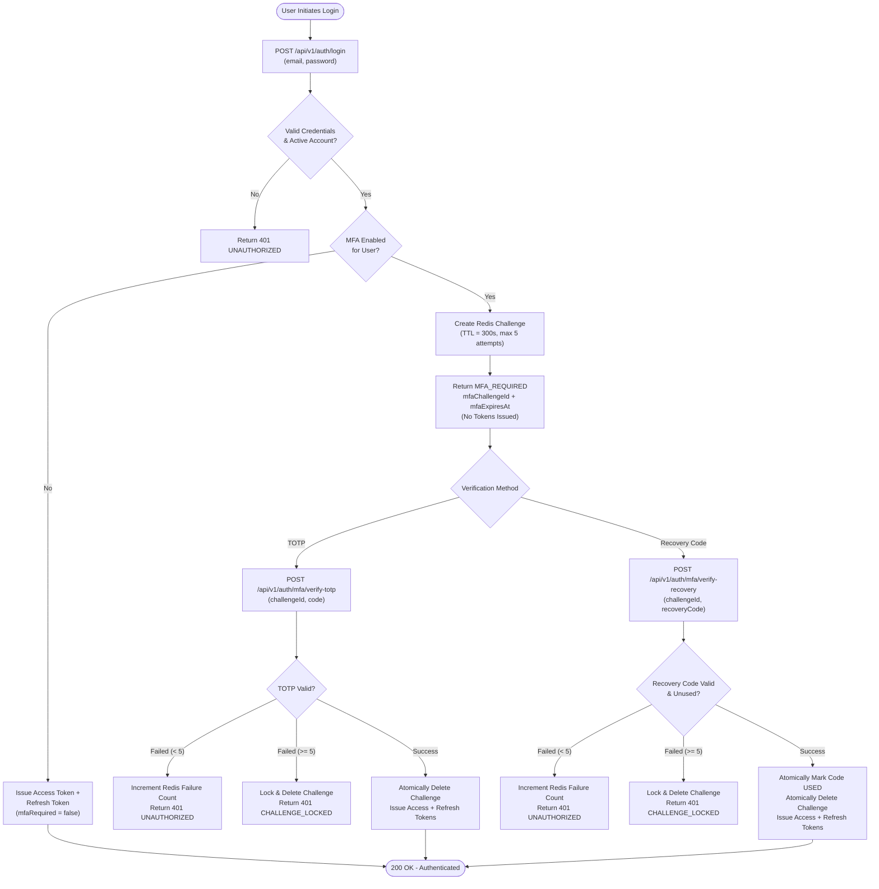

# SecretVault MFA API & Login Integration Architecture (Phase 5.7.4)

## 1. Overview & Objectives

Phase 5.7.4 integrates the RFC 6238 TOTP engine, PostgreSQL MFA persistence layer, and Redis security-state machine developed in Phases 5.7.1–5.7.3 into SecretVault's primary authentication REST API (`/api/v1/auth/*`) and dedicated MFA controller (`/api/v1/auth/mfa/*`).

### Core Architectural Guarantees
1. **Zero Pre-Auth Token Leakage**: When MFA is enabled on an account, primary credential verification (`POST /api/v1/auth/login`) yields *only* a transient `mfaChallengeId` and `mfaExpiresAt`. Zero JWT access tokens or refresh tokens are issued until secondary verification completes.
2. **Dual-Path Challenge Resolution**: Active MFA challenges can be resolved via either a 6–8 digit time-based one-time password (TOTP) or a 12-character single-use backup recovery code.
3. **Strict Challenge Consumption**: Challenges stored in Redis are single-use (`auth:mfa:challenge:{challengeId}`). Successful verification atomically removes the challenge and issues a fresh session with access and refresh tokens.
4. **Fail-Closed Lockout Defense**: 5 failed verification attempts against a challenge immediately transition the challenge state to `MFA_CHALLENGE_LOCKED` and evict it from Redis, preventing brute-force attacks.
5. **Rate-Limited Surface**: All pre-auth and post-auth endpoints are protected by Redis distributed sliding-window rate limiters.

---

## 2. Authentication Flow & State Transition



---

## 3. REST API Specification

### 3.1 Public Authentication Endpoints (`/api/v1/auth`)

| Endpoint | Method | Security | Rate Limit | Description |
| :--- | :--- | :--- | :--- | :--- |
| `/api/v1/auth/register` | `POST` | Public | None | User registration and organization bootstrap |
| `/api/v1/auth/login` | `POST` | Public | 10 req / 60s (IP) | Primary credential authentication; returns tokens or MFA challenge |
| `/api/v1/auth/refresh` | `POST` | Public | 30 req / 60s (IP) | Rotates refresh token and issues fresh JWT access token |
| `/api/v1/auth/me` | `GET` | Bearer JWT | None | Current authenticated user profile |
| `/api/v1/auth/logout` | `POST` | Bearer JWT | None | Revokes active refresh tokens for the caller |

### 3.2 MFA Endpoints (`/api/v1/auth/mfa`)

| Endpoint | Method | Security | Rate Limit | Description |
| :--- | :--- | :--- | :--- | :--- |
| `/api/v1/auth/mfa/verify-totp` | `POST` | Public (Pre-Auth) | 10 req / 60s (IP) | Verifies TOTP code against active login challenge and issues tokens |
| `/api/v1/auth/mfa/verify-recovery` | `POST` | Public (Pre-Auth) | 10 req / 60s (IP) | Verifies single-use backup recovery code and issues tokens |
| `/api/v1/auth/mfa/status` | `GET` | Bearer JWT | None | Retrieves user's MFA status and remaining recovery code count |
| `/api/v1/auth/mfa/enroll` | `POST` | Bearer JWT | 5 req / 60s (User) | Initiates MFA enrollment, returns TOTP secret and QR URI |
| `/api/v1/auth/mfa/activate` | `POST` | Bearer JWT | 10 req / 60s (User) | Verifies initial code, enables MFA, and returns 10 recovery codes |
| `/api/v1/auth/mfa/disable` | `POST` | Bearer JWT | 5 req / 60s (User) | Disables MFA and revokes all recovery codes for user |

---

## 4. DTO Schemas & Data Models

### 4.1 `AuthResponse`
```json
{
  "accessToken": "eyJhbGciOiJIUzI1NiIsInR5cCI6IkpXVCJ9...",
  "refreshToken": "7c9e6679-7425-40de-944b-e07fc1f90ae7",
  "tokenType": "Bearer",
  "expiresIn": 86400,
  "user": {
    "id": "3fa85f64-5717-4562-b3fc-2c963f66afa6",
    "email": "user@example.com",
    "fullName": "Alice Vance",
    "status": "ACTIVE"
  },
  "activeWorkspace": {
    "id": "4b685f64-5717-4562-b3fc-2c963f66afa7",
    "name": "Default Workspace",
    "slug": "default",
    "role": "OWNER"
  },
  "mfaRequired": false,
  "mfaChallengeId": null,
  "mfaExpiresAt": null
}
```

When MFA is required (`mfaRequired = true`):
```json
{
  "accessToken": null,
  "refreshToken": null,
  "tokenType": null,
  "expiresIn": 0,
  "user": null,
  "activeWorkspace": null,
  "mfaRequired": true,
  "mfaChallengeId": "9b1deb4d-3b7d-4bad-9bdd-2b0d7b3dcb6d",
  "mfaExpiresAt": "2026-10-02T21:15:00Z"
}
```

### 4.2 `MfaEnrollResponse`
```json
{
  "secret": "JBSWY3DPEHPK3PXP",
  "provisioningUri": "otpauth://totp/SecretVault:user@example.com?secret=JBSWY3DPEHPK3PXP&issuer=SecretVault",
  "issuer": "SecretVault",
  "accountName": "user@example.com"
}
```

### 4.3 `MfaActivateResponse`
```json
{
  "status": "ENABLED",
  "recoveryCodes": [
    "2345-6789-ABCD",
    "3456-789A-BCDE",
    "4567-89AB-CDEF",
    "5678-9ABC-DEFG",
    "6789-ABCD-EFGH",
    "789A-BCDE-FGHI",
    "89AB-CDEF-GHIJ",
    "9ABC-DEFG-HIJK",
    "ABCD-EFGH-IJKL",
    "BCDE-FGHI-JKLM"
  ]
}
```

### 4.4 `MfaStatusResponse`
```json
{
  "enabled": true,
  "status": "ENABLED",
  "enrolledAt": "2026-10-02T20:00:00Z",
  "verifiedAt": "2026-10-02T20:01:00Z",
  "lastUsedAt": "2026-10-02T21:05:00Z",
  "remainingRecoveryCodes": 9
}
```

---

## 5. Security Invariants & Defense in Depth

1. **Envelope Encryption for TOTP Secrets**:
   - Secrets are encrypted with AES-256-GCM under the master KMS DEK before being stored in the `user_mfa` table.
   - Plaintext secret is only held in memory during enrollment provisioning and TOTP verification.
2. **SHA-256 Hashing for Recovery Codes**:
   - Plaintext recovery codes are displayed exactly once during activation.
   - Database stores only cryptographic hashes (`SHA-256`), preventing exposure if the database is compromised.
   - Code consumption is atomic and irreversible (`used = true`, `used_at = NOW()`).
3. **Redis Challenge Protection**:
   - State machine prevents challenge replay, race conditions, or tampering.
   - Distributed IP rate limiting prevents distributed brute force attacks against challenge endpoints.
4. **Log Sanitization**:
   - All MFA DTOs (`MfaEnrollResponse`, `MfaActivateResponse`, `MfaTotpVerifyRequest`, `MfaRecoveryVerifyRequest`) override `toString()` to redact secrets, provisioning URIs, and recovery codes.

---

## 6. Verification & Test Suite Summary

- **Total Backend Tests Passing**: 491 tests (0 failures, 0 errors, 0 skipped).
- **New Unit Tests**:
  - `AuthServiceTest`: MFA bifurcation on login, challenge generation, TOTP/recovery verification, token withholding.
- **New Controller & Integration Tests**:
  - `MfaControllerTest`: Status retrieval, enrollment flow, activation, disablement, 401 unauthenticated access rejection.
  - `AuthMfaLoginIntegrationTest`: Complete end-to-end authentication lifecycle with TOTP verification, recovery code verification, recovery code one-time consumption, recovery code replay prevention, and 5-attempt challenge lockout.
