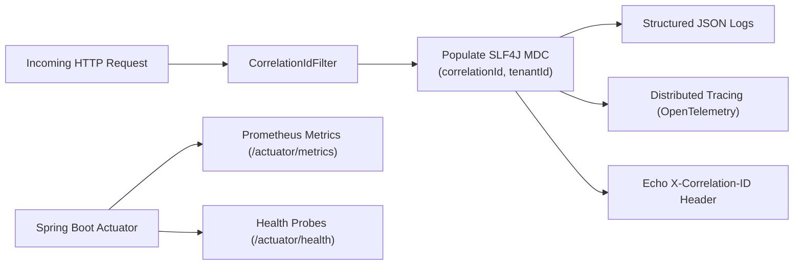

# SecretVault — Observability, Metrics & Telemetry

## 1. Observability Architecture

SecretVault incorporates full-spectrum telemetry across structured logging, distributed tracing, and health probes:

---

## 2. Distributed Tracing & Correlation IDs [IMPLEMENTED]

- **Filter:** `CorrelationIdFilter` inspects incoming HTTP requests for `X-Correlation-ID` or `X-Request-ID`.
- **Generation:** If absent, a cryptographically random UUID is generated.
- **MDC Propagation:** The correlation ID is placed in SLF4J MDC (`correlationId`), included in all log messages, and returned in the HTTP response headers.

---

## 3. Health & Readiness Probes [IMPLEMENTED]

- **Public Baseline Health:** `GET /api/v1/health`
- **Actuator Health Probe:** `GET /actuator/health`
  - Validates PostgreSQL connectivity (`db`), Redis connectivity (`redis`), and disk space.
- **Actuator Info Probe:** `GET /actuator/info`

---

## 4. Inviolable Telemetry Security Rules

- ❌ **NEVER log secret values**, decrypted environment variables, or raw cryptographic keys.
- ❌ **NEVER log authorization tokens** or password strings in log lines or query params.
- ✅ Always log actor IDs, IP addresses, tenant context, resource IDs, execution latency, and action outcomes.
