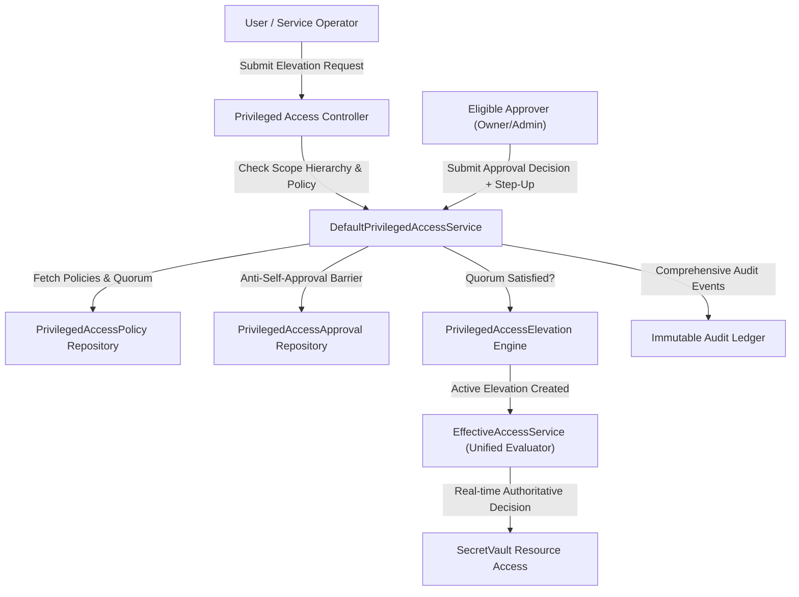

# Privileged Access Security: Dual Approval Quorum, Temporary Elevation & Break-Glass

## 1. Architectural Overview & Zero Standing Privilege (ZSP)

SecretVault Phase 5.8.4 implements **Privileged Access Security (PAS)**, extending the platform's defense-in-depth security model to eliminate standing high-privilege access. Standing administrative permissions represent one of the most critical vulnerabilities in modern infrastructure. SecretVault mandates that high-impact operations require explicit, policy-governed approval quorum and real-time evaluated temporary elevation.



---

## 2. Privileged Action Classification

All privileged actions are centralized in the `PrivilegedAction` domain enumeration:

| Action Name | Target Scope | Description | Default Quorum |
| :--- | :--- | :--- | :--- |
| `SECRET_REVEAL` | ENVIRONMENT / SECRET | Reveal decrypted plaintext value of high-risk secrets | 1 (or 2 for prod) |
| `SECRET_DELETE` | ENVIRONMENT / SECRET | Permanent deletion of secret or all secret versions | 2 |
| `SECRET_EXPORT` | PROJECT / ENVIRONMENT | Bulk plaintext export of workspace or project secrets | 2 |
| `SECRET_PERMANENT_PURGE` | ENVIRONMENT / SECRET | Hard-purge of soft-deleted secrets bypassing retention | 2 |
| `ROLE_CHANGE` | WORKSPACE | Elevate or alter workspace membership roles | 2 |
| `POLICY_OVERRIDE` | WORKSPACE | Override branch/environment security constraints | 2 |
| `BREAK_GLASS_REQUEST` | ENVIRONMENT / SECRET | Emergency incident elevation during catastrophic outage | 1 + Step-Up |
| `ENVIRONMENT_DELETE` | PROJECT / ENVIRONMENT | Deletion of entire environment and its secret storage | 2 |
| `PROJECT_DELETE` | PROJECT | Deletion of project and all associated configurations | 2 |
| `ROTATION_FORCE` | ENVIRONMENT / SECRET | Force emergency cryptographic rotation of active keys | 1 |
| `AUDIT_LOG_EXPORT` | WORKSPACE | Bulk export of raw security and compliance audit logs | 2 |
| `KMS_KEY_ROTATION` | WORKSPACE | Trigger rotation of primary envelope Key Encryption Key (KEK) | 2 |
| `INTEGRATION_SYNC_FORCE` | WORKSPACE / PROJECT | Force live bidirectional sync to external cloud providers | 1 |
| `SERVICE_ACCOUNT_TOKEN_CREATE`| WORKSPACE | Issue high-privilege machine-to-machine tokens | 2 |
| `ACCESS_POLICY_UPDATE` | WORKSPACE | Modify privileged access or dual approval policies | 2 |
| `WORKSPACE_OWNER_TRANSFER` | WORKSPACE | Transfer primary workspace ownership | 2 |
| `IP_ALLOWLIST_OVERRIDE` | WORKSPACE | Bypass or modify CIDR network allowlist rules | 2 |

---

## 3. Four-Eyes / Dual Approval Protocol

1. **Anti-Self-Approval Enforcement**: Requesters (`requester_id`) and target beneficiaries (`target_user_id`) cannot approve their own requests under any circumstances (`approver != requester && approver != targetUser`).
2. **Authority Verification**: Approvers must possess governance authority over the target scope (Workspace `OWNER` or `ADMIN`, or project governance lead).
3. **Idempotent Voting**: Each approver is limited to exactly one recorded decision per request; duplicate votes are rejected.
4. **Atomic Quorum Evaluation**: Approval decisions are evaluated dynamically against current effective policy at the time of voting. Requests remain `PENDING` until `distinctApproved >= requiredQuorum`.
5. **Auto-Elevation Activation**: Once quorum is satisfied, the request transitions to `APPROVED` and an active `PrivilegedAccessElevation` grant is automatically generated.

---

## 4. Emergency Break-Glass Protocol

Break-Glass emergency access allows operators to handle catastrophic production incidents where normal dual approval chains are inaccessible:

1. **Strictly Bounded Scope**: Break-glass access is explicitly scoped to a designated project, environment, or secret target. It **never** grants root, `OWNER`, or unrestricted workspace control.
2. **Mandatory Comprehensive Justification**: Requesters must provide a detailed justification of at least 20 characters documenting incident context.
3. **Mandatory Step-Up Authentication**: Execution requires valid, consumable Step-Up proof (WebAuthn/Passkey or hardware token).
4. **Hard Time Bounds**: Maximum emergency duration is strictly capped (e.g. 15, 30, or 60 minutes) as configured in workspace policy.
5. **Dual Audit Ledger**: Every break-glass activation logs both `BREAK_GLASS_REQUESTED` and `BREAK_GLASS_EXECUTED` events, notifying security teams in real time.

---

## 5. Authoritative Real-Time Evaluation Pipeline

The `EffectiveAccessService` authorization engine evaluates temporary privileged elevations and break-glass grants directly in its authoritative decision pipeline:

```
Authorization Flow:
1. Validate Workspace Context & Membership
2. Check Explicit Resource Denials
3. Check Authoritative Privileged Elevations (PrivilegedAccessElevationRepository.findActiveElevationsForUser):
   - If active grant matches target scope & permission:
     -> Return ALLOWED (Source: PRIVILEGED_ELEVATION / BREAK_GLASS)
4. Check Ephemeral JIT Access Grants
5. Check Explicit Resource Grants (AccessGrant)
6. Check Standing Role Matrix (RBAC)
7. Default: DENIED
```

Elevations are verified dynamically against `clock.instant().isBefore(expiresAt)`. Expired or revoked grants fail immediately.

---

## 6. Database Schema (`V15__privileged_access_security_schema.sql`)

- `privileged_access_policies`: Configurable policies per scope and action.
- `privileged_access_requests`: Formal request ledger tracking lifecycle state (`PENDING`, `APPROVED`, `REJECTED`, `EXECUTED`, `EXPIRED`, `CANCELLED`, `REVOKED`).
- `privileged_access_approvals`: Immutable approval votes recording approver ID, decision, timestamp, and optional step-up factor.
- `privileged_access_elevations`: Active temporary authorization records evaluated during authorization decisions.

---

## 7. Adversarial Threat Verification Matrix (PA-01 to PA-40)

All 40 threat scenarios are verified by automated test suites:

- **PA-01 to PA-05**: Authentication, Cross-Tenant, Cross-Workspace, Cross-Project, and Cross-Environment Boundary Validation.
- **PA-06 to PA-11**: Quorum and Authority Enforcement (Anti-Self-Approval, Idempotency, Quorum bypass prevention, Scoped authority).
- **PA-12 to PA-17**: Expiration & Revocation Integrity (Real-time expiration enforcement, Immediate revocation, Invariant state transitions).
- **PA-18 to PA-21**: Identity, Policy & Session Governance (Suspended user blocking, Session revocation fail-closed, Dynamic policy evaluation).
- **PA-22 to PA-26**: Break-Glass Safety (Duration cap enforcement, Cross-tenant rejection, Step-Up requirement, Justification validation, Replay attack protection).
- **PA-27 to PA-32**: Concurrency & Failure Resilience (Atomic quorum calculations, Race conditions handling, Fail-closed Redis outages, Rate limiting).
- **PA-33 to PA-40**: Data Leakage & Authorization Invariants (IDOR prevention, Mass assignment protection, Sensitive data redaction in DTOs, Privilege loss invalidation).
