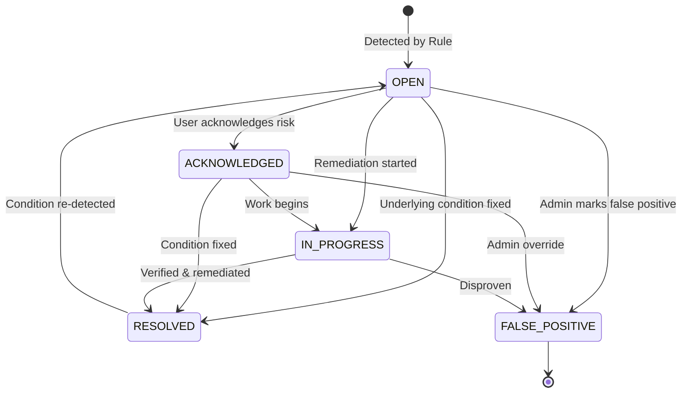

# SecretVault — Security Intelligence & Detection Engine

## 1. Executive Overview

The **Security Intelligence Engine** delivers real-time, deterministic threat detection, continuous privilege posture evaluation, and explainable risk scoring across SecretVault workspaces. It continuously analyzes standing RBAC memberships, scoped project/environment permissions, granular access grants, Just-In-Time (JIT) elevations, access review certification records, and security audit telemetry.

### Core Architectural Principles:
1. **100% Deterministic & Explainable:** Zero non-deterministic heuristics or black-box LLM hallucinations. Every score, factor, and finding maps directly to concrete underlying authorization and telemetry facts with actionable attribution.
2. **Deterministic SHA-256 Fingerprinting:** Findings are uniquely fingerprinted based on workspace, category, and target identity (`SHA256(workspaceId:category:targetKey)`). Repeated evaluations increment occurrence counts and update observation timestamps rather than generating duplicate spam.
3. **Zero Secret Leakage in Telemetry & Findings:** All event metadata and finding evidence is sanitized through `SafeEventMetadataSanitizer`, preventing passwords, tokens, private keys, or secret payloads from ever appearing in intelligence logs or REST payloads.
4. **Tenant-Isolated Execution:** Analysis runs strictly per-workspace. Cross-workspace scanning or cross-tenant data contamination is architecturally impossible.

---

## 2. Deterministic Security Detection Rules

The intelligence engine evaluates **10 deterministic security detection rules** against workspace state:

| Rule Code | Category | Severity | Confidence | Trigger Condition | Deterministic Remediation |
|---|---|---|---|---|---|
| `RULE-01` | `EXCESSIVE_PRIVILEGE` | `HIGH` | `HIGH` | Workspace member possesses standing `OWNER` or `ADMIN` role with zero project/environment scoping constraints. | Scope administrative rights to explicit projects/environments or transition to ephemeral JIT elevations. |
| `RULE-02` | `PRIVILEGE_ESCALATION_PATTERN` | `HIGH` | `HIGH` | User submitted 3 or more JIT elevation requests within 24 hours or had multiple rapid elevation grants. | Review justification frequency with user's manager; convert recurring operational tasks into standard scoped access. |
| `RULE-03` | `SUSPICIOUS_JIT_ACTIVITY` | `HIGH` | `HIGH` | Rapid successive JIT requests, unusual duration requests, or repeated elevation denials. | Audit request justifications and verify approving authority adherence to separation of duties. |
| `RULE-04` | `REPEATED_AUTHORIZATION_FAILURES` | `HIGH` | `HIGH` | Single actor accumulated 5 or more authorization denials (`AUTHORIZATION_DENIED`) within a 24-hour window. | Investigate potential automated credential stuffing, misconfigured service accounts, or privilege probing. |
| `RULE-05` | `UNUSUAL_ADMIN_ACTIVITY` | `MEDIUM` | `MEDIUM` | Workspace experienced 10 or more administrative governance changes (membership/role/scope mutations) within 24 hours. | Verify change management tickets and audit log trails for unexpected batch permission grants. |
| `RULE-06` | `DORMANT_PRIVILEGED_ACCESS` | `MEDIUM` | `HIGH` | Member holds `OWNER` or `ADMIN` standing privileges but has logged zero activity in the workspace for 30+ days. | Deprovision dormant administrator privileges or downgrade to standard Developer/Viewer standing role. |
| `RULE-07` | `ACCESS_REVIEW_OVERDUE` | `HIGH` | `HIGH` | Workspace has one or more access review certification campaigns past due date in `OPEN` or `IN_PROGRESS` status. | Finalize pending campaign decisions and execute targeted revocations to maintain compliance posture. |
| `RULE-08` | `UNUSED_GRANULAR_GRANT` | `LOW` | `MEDIUM` | Granular resource grant (`access_grants`) created 14+ days ago with no associated access activity. | Revoke redundant granular grant to minimize standing privilege surface area. |
| `RULE-09` | `ACCESS_CONCENTRATION` | `MEDIUM` | `HIGH` | Over 50% of total active workspace members hold privileged `OWNER` or `ADMIN` standing roles. | Rebalance workspace membership tiering to enforce least privilege separation. |
| `RULE-10` | `AUTHENTICATION_ANOMALY` | `HIGH` | `HIGH` | User accumulated 5 or more failed login attempts (`AUTH_LOGIN_FAILURE`) or account lockout events. | Prompt user for password reset, verify multi-factor authentication enrollment, and review source IP telemetry. |

---

## 3. Explainable Risk Scoring Engine

Workspace risk is quantified into a normalized score $\text{Score} \in [0, 100]$ accompanied by qualitative `RiskLevel` thresholds and attributed factor explanations.

### Mathematical Formulation:
$$\text{Raw Risk Score} = \min\left(100, \sum_{i=1}^{n} w_i \times \text{sev}(f_i) + \text{CoveragePenalty} + \text{ActivityPenalty}\right)$$

Where:
- **Active Findings Contribution:**
  - $\text{CRITICAL}$ finding: $+25$ points each
  - $\text{HIGH}$ finding: $+15$ points each
  - $\text{MEDIUM}$ finding: $+8$ points each
  - $\text{LOW}$ finding: $+3$ points each
- **Review Health Penalties:**
  - Overdue certification campaign: $+20$ points
  - No access reviews ever configured: $+10$ points
- **Telemetry Penalties:**
  - $>10$ Authorization denials in 24h: $+15$ points
  - $>20$ Rapid admin changes in 24h: $+10$ points
- **Mitigating Deductions:**
  - Active, healthy access review completed in last 30 days: $-10$ points
  - 100% of JIT elevations properly expired/revoked: $-5$ points

### Risk Level Categorization:
| Risk Level | Numerical Range | Definition & Recommended Action |
|---|---|---|
| `LOW` | $0 - 24$ | Strong security posture; minimal standing privileges, healthy review cycle. |
| `MEDIUM` | $25 - 49$ | Moderate risk; minor privilege accumulation or stale grants detected. |
| `HIGH` | $50 - 74$ | Elevated risk; multiple unaddressed high findings or overdue compliance reviews. |
| `CRITICAL` | $75 - 100$ | Urgent risk; severe authorization anomalies, privilege escalation patterns, or critical vulnerabilities. |

Each score calculation returns a list of `RiskFactorExplanation` objects with name, contribution points, category, and human-readable explanation.

---

## 4. Security Finding Lifecycle State Machine

Security findings progress through a deterministic lifecycle:

### Supported Transitions:
- `ACKNOWLEDGE`: Acknowledges awareness of finding without resolving.
- `START_PROGRESS`: Assigns remediation workflow (`assigneeUserId`).
- `RESOLVE`: Marks resolved with mandatory remediation justification.
- `MARK_FALSE_POSITIVE`: Flags finding as false positive (requires `SECURITY_MANAGE` authority).
- `REOPEN`: Automatically reopens if subsequent scan detects recurring violation.

---

## 5. Safe Event Metadata Sanitization

The `SafeEventMetadataSanitizer` enforces strict zero-trust hygiene before persisting or serializing telemetry:

1. **Forbidden Key Inspection:** Any JSON key containing substrings `secret`, `token`, `password`, `key`, `authorization`, `credential`, `private`, `bearer`, or `dek` is replaced with `"[REDACTED_SENSITIVE_FIELD]"`.
2. **Strict Type Conversion:** Preserves primitive safe types (UUID strings, numbers, booleans, timestamps).
3. **Payload Truncation:** Caps metadata string lengths to prevent storage exhaustion.

---

## 6. Background Scheduled Analysis

The `SecurityIntelligenceScheduler` runs continuous automated security evaluations:
- **Frequency:** Evaluates all active workspaces on a configurable cron schedule (`app.security.analysis-cron=0 */15 * * * *`, default every 15 minutes).
- **Concurrency Isolation:** Per-workspace locks guarantee that concurrent manual trigger API calls and background scheduled tasks do not race.
- **Audited Execution:** Every scheduled or manual scan emits a `SECURITY_ANALYSIS_EXECUTED` security event with summary metrics.
