# SecretVault — WebAuthn / FIDO2 / Passkeys Architecture

**Version:** 1.0.0 (Phase 5.8.3)  
**Security Classification:** Highly Sensitive — Security Control Plane Core  
**Authoritative Implementation:** SecretVault Security Engineering

---

## 1. Executive Summary & Architectural Invariant

Phase 5.8.3 introduces production-grade **WebAuthn / FIDO2 Passkey Support** into SecretVault as a first-class, phishing-resistant authentication factor, MFA factor, and Step-Up re-authentication factor.

### Crucial Architectural Principle
> **WebAuthn is an authentication FACTOR, NOT an authorization mechanism.**

WebAuthn never grants permissions, never bypasses Role-Based Access Control (RBAC), never bypasses Just-In-Time (JIT) access elevation, never bypasses multi-tenant isolation, and never bypasses protected environment controls.

```
Authentication (Password / Passkey)
        ↓
MFA (TOTP / Recovery / WebAuthn)
        ↓
Session Management (UserSession & Refresh Tokens)
        ↓
Step-Up Authentication (StepUpPolicyService & StepUpProof)
        ↓
Authorization (RBAC / EffectiveAccessService / Environment Protection)
        ↓
Sensitive Operation (Secret Reveal, Deletion, Promotion)
```

---

## 2. Selected Cryptographic Library

To adhere to cryptographic best practices and avoid custom protocol implementations:
- **Library:** `com.yubico:webauthn-server-core:2.9.0`
- **Compatibility:** Java 21, Spring Boot 3.3.x, Jackson 2.17.x, BouncyCastle.
- **Rationale:** Mature, industry-standard, fully audited FIDO2 / WebAuthn Level 3 compliant server implementation maintained by Yubico. Handles CBOR/COSE decoding, ASN.1/DER/ECDSA/EdDSA/RSA cryptographic verification, authenticator data parsing, and attestation format inspection.

---

## 3. Database Model & Schema (`user_webauthn_credentials`)

WebAuthn public credential material and metadata are stored in the PostgreSQL table `user_webauthn_credentials` managed by Flyway migration `V14__webauthn_credentials_schema.sql`.

```sql
CREATE TABLE user_webauthn_credentials (
    id UUID PRIMARY KEY DEFAULT gen_random_uuid(),
    user_id UUID NOT NULL REFERENCES users(id) ON DELETE RESTRICT,
    credential_id VARCHAR(512) NOT NULL,
    public_key_cose BYTEA NOT NULL,
    sign_count BIGINT NOT NULL DEFAULT 0,
    aaguid VARCHAR(64),
    credential_type VARCHAR(64) NOT NULL DEFAULT 'public-key',
    transports VARCHAR(256),
    user_verified_capable BOOLEAN NOT NULL DEFAULT true,
    backup_eligible BOOLEAN NOT NULL DEFAULT false,
    backup_state BOOLEAN NOT NULL DEFAULT false,
    discoverable BOOLEAN NOT NULL DEFAULT false,
    attestation_format VARCHAR(64) DEFAULT 'none',
    friendly_name VARCHAR(128) NOT NULL,
    created_at TIMESTAMP WITH TIME ZONE NOT NULL DEFAULT NOW(),
    last_used_at TIMESTAMP WITH TIME ZONE,
    last_used_ip VARCHAR(64),
    revoked_at TIMESTAMP WITH TIME ZONE,
    revocation_reason VARCHAR(256),
    version BIGINT NOT NULL DEFAULT 0,
    CONSTRAINT uk_webauthn_credential_id UNIQUE (credential_id)
);
```

### Key Schema Protections
1. **Private Keys:** Authenticators generate and retain private keys strictly inside secure hardware (Secure Enclave, TPM, Titan/YubiKey chips). The server receives and stores **only** the public key in COSE format (`public_key_cose`).
2. **Uniqueness:** `credential_id` is globally unique across all users.
3. **Foreign Key:** `ON DELETE RESTRICT` ensures credential rows cannot be accidentally orphaned or cascade-deleted outside governance workflows.
4. **Soft Revocation:** Revoked credentials retain audit history with `revoked_at` timestamp and `revocation_reason`.

---

## 4. WebAuthn Ceremonies & State Machine

```mermaid
sequenceDiagram
    autonumber
    actor User as User Browser / Device
    participant Backend as WebAuthnController & Service
    participant Redis as RedisSecurityStateStore
    participant DB as PostgreSQL (Credentials Table)

    %% Registration Ceremony
    rect rgb(30, 0, 10)
    Note over User, DB: 1. Registration Ceremony (Authenticated User)
    User->>Backend: POST /api/v1/auth/webauthn/registration/options
    Backend->>Redis: Store challenge (TTL=300s, user-bound, session-bound)
    Backend-->>User: Return PublicKeyCredentialCreationOptions JSON
    User->>User: navigator.credentials.create() [Touch ID / YubiKey]
    User->>Backend: POST /api/v1/auth/webauthn/registration/verify
    Backend->>Redis: consumeAtomic(challenge) [Lua GET + DEL]
    Backend->>Backend: RelyingParty.finishRegistration(challenge, origin, rpId)
    Backend->>DB: Persist UserWebAuthnCredential
    Backend-->>User: 201 Created (Safe Metadata DTO)
    end

    %% Authentication Ceremony
    rect rgb(45, 0, 15)
    Note over User, DB: 2. Authentication Ceremony (Passkey Login)
    User->>Backend: POST /api/v1/auth/webauthn/authentication/options { email? }
    Backend->>Redis: Store auth challenge (TTL=300s, IP-bound)
    Backend-->>User: Return PublicKeyCredentialRequestOptions JSON
    User->>User: navigator.credentials.get() [Biometric / Security Key]
    User->>Backend: POST /api/v1/auth/webauthn/authentication/verify
    Backend->>Redis: consumeAtomic(challenge) [Lua GET + DEL]
    Backend->>Backend: RelyingParty.finishAssertion() + Sign-Count Check
    Backend->>DB: Update last_used_at, sign_count, last_used_ip
    Backend->>Backend: Create UserSession & Issue JWT + Refresh Token
    Backend-->>User: 200 OK (AuthResponse + Set-Cookie)
    end
```



---

## 5. Step-Up Authentication Integration

WebAuthn integrates directly with the existing `StepUpAuthenticationService` and `StepUpPolicyService` as `StepUpFactor.WEBAUTHN`.

When performing a protected operation (e.g. `SECRET_REVEAL` in `PRODUCTION`):
1. **Challenge Issuance:** Caller requests step-up challenge (`POST /api/v1/auth/step-up/challenges`). If the user has active WebAuthn credentials, `WEBAUTHN` is included in `supportedFactors`.
2. **Options Fetch:** Client calls `POST /api/v1/auth/step-up/challenges/{challengeId}/webauthn/options` to obtain assertion options bound to the active step-up session.
3. **Hardware Assertion:** Client invokes `navigator.credentials.get(options)`.
4. **Verification & Proof Issuance:** Client calls `POST /api/v1/auth/step-up/challenges/{challengeId}/verify-webauthn`. On successful cryptographic verification, SecretVault produces a cryptographically random, single-use, 300-second TTL `StepUpProofPayload` in Redis.
5. **Execution:** Sensitive endpoints (e.g. `GET /api/v1/secrets/{id}/reveal`) pass `X-Step-Up-Proof: <token>`. The service consumes the proof atomically via `consumeAtomic` (Lua GET+DEL) and proceeds to standard authorization and audit logging.

---

## 6. Security Policies & Hardening

### A. Origin & Relying Party (RP) ID Validation
- `rp-id`: Must match configured domain (e.g. `secretvault.dev` in production, `localhost` in local dev). User-controlled host headers and arbitrary hostnames are strictly rejected.
- `allowed-origins`: Explicit allowlist (e.g. `https://app.secretvault.dev`). Wildcard origins (`*`) are disallowed.

### B. User Verification Policy
- Privileged operations and registration enforce `UserVerificationRequirement.PREFERRED` / `REQUIRED` to ensure local PIN or biometric verification occurred on the authenticator.

### C. Authenticator Sign-Count & Clone Detection
- Authenticator signatures maintain an incrementing counter (`sign_count`).
- If an authenticator counter decreases unexpectedly (counter rollback), `DefaultWebAuthnService` detects potential credential cloning, logs a critical audit action `WEBAUTHN_CLONE_DETECTED`, and responds according to configured policy (`ALERT_AND_CHALLENGE`).

### D. Single-Use Challenges & Redis Ephemeral State
- Challenges are generated using `SecureRandom` (32 bytes / 256-bit entropy).
- Stored exclusively in Redis with 300-second TTL.
- Atomic consumption via Lua scripts (`redis.call('get', KEYS[1]); redis.call('del', KEYS[1])`) guarantees that under high concurrency (16+ simultaneous requests), exactly one succeeds and all replays fail.

### E. Lockout Prevention
- Before revoking a WebAuthn credential (`DELETE /api/v1/auth/webauthn/credentials/{id}`), the service verifies that the user retains at least one viable authentication mechanism (e.g. password, remaining passkeys, or active MFA recovery codes).

---

## 7. Rate Limiting & Audit Logging

| Endpoint | Rate Limit Category | Limit / Window | Identifier |
| :--- | :--- | :--- | :--- |
| `POST /api/v1/auth/webauthn/registration/options` | `webauthn_reg_options` | 10 req / 60s | User ID |
| `POST /api/v1/auth/webauthn/registration/verify` | `webauthn_reg_verify` | 10 req / 60s | User ID |
| `POST /api/v1/auth/webauthn/authentication/options` | `webauthn_auth_options` | 20 req / 60s | Client IP |
| `POST /api/v1/auth/webauthn/authentication/verify` | `webauthn_auth_verify` | 20 req / 60s | Client IP |
| `POST /api/v1/auth/step-up/challenges/{id}/webauthn/options` | `step_up_webauthn_opts` | 10 req / 60s | User ID |
| `POST /api/v1/auth/step-up/challenges/{id}/verify-webauthn` | `step_up_verify_webauthn` | 5 req / 60s | User ID |

### Audit Actions Logged
- `WEBAUTHN_REGISTRATION_STARTED`
- `WEBAUTHN_REGISTRATION_SUCCESS`
- `WEBAUTHN_REGISTRATION_FAILED`
- `WEBAUTHN_AUTHENTICATION_STARTED`
- `WEBAUTHN_AUTHENTICATION_SUCCESS`
- `WEBAUTHN_AUTHENTICATION_FAILED`
- `WEBAUTHN_CREDENTIAL_RENAMED`
- `WEBAUTHN_CREDENTIAL_REVOKED`
- `WEBAUTHN_CHALLENGE_EXPIRED`
- `WEBAUTHN_REPLAY_REJECTED`
- `WEBAUTHN_CLONE_DETECTED`

No private key, password, challenge secret, or full assertion signature is ever emitted to audit logs or console streams.
