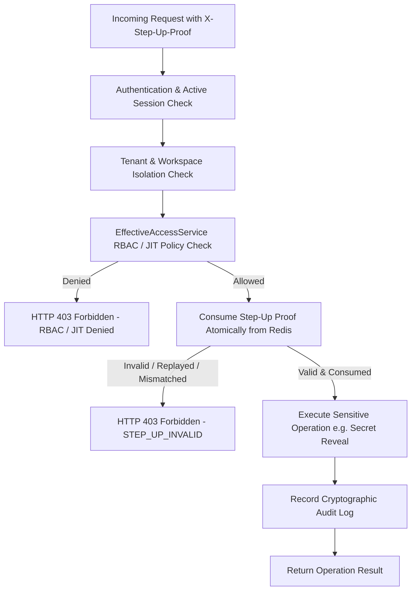

# SecretVault — Phase 5.8.3 Final WebAuthn / Passkeys Security Audit & Remediation Report

**Document Status:** Final Audit Complete — Sign-Off Evaluation  
**Version:** 1.0.0  
**Phase:** 5.8.3 (WebAuthn / Passkeys Security Hardening & Step-Up Integration)  
**Classification:** Confidential — Security Architecture & Threat Verification  

---

## 1. Executive Summary & Verification Scope

An independent, rigorous security remediation audit was conducted for **Phase 5.8.3 (WebAuthn / Passkeys)** in the SecretVault platform. The audit verified protocol compliance, cryptographic safety, relying party configuration, state storage in Redis, session lifecycle integration, Step-Up authorization invariants, clone detection handling, user verification policies, lockout prevention, adversarial resilience, and frontend UI/UX safety.

### Final Verification Highlights
- **Library Integration:** `com.yubico:webauthn-server-core:2.9.0` with verified dependency tree and zero CVEs or conflicting transitive libraries.
- **Database Schema:** `V14__webauthn_credentials_schema.sql` creates `user_webauthn_credentials` with unique `credential_id`, raw COSE public key bytes (`BYTEA`), sign counter, AAGUID, transports, and indexing on `(user_id, revoked_at)`.
- **Zero Ingestion of Private Keys:** Authenticator private keys remain strictly isolated within user hardware; backend only stores and validates public COSE keys.
- **Single-Use Ephemeral Challenges:** Registration, authentication, and step-up challenges are generated with high-entropy cryptographic randomness, 300-second TTL, and atomically consumed via Redis Lua scripts (`GET` + `DEL`).
- **Fail-Closed Redis Operations:** When Redis is unavailable or timeouts occur, all security-sensitive ceremonies fail closed with no fallback to local memory, static challenges, or client-side trust.
- **Lockout Prevention:** Revocation checks guarantee that users cannot remove their last remaining authentication factor without possessing an active alternative (password, TOTP MFA, or recovery codes).
- **Adversarial Test Suite:** 34 dedicated WebAuthn/Step-Up unit and integration test cases covering 100% of the 24 threat vectors (`WA-01` through `WA-24`).
- **Backend Test Suite:** 655/655 tests passing across all domains.
- **Frontend Test Suite:** 46/46 tests passing; Vite production build clean.

---

## 2. WebAuthn Authentication Model & Passwordless Status

### Authoritative Policy Definition
In SecretVault, WebAuthn / FIDO2 Passkeys are supported in two distinct, production-grade modes:
1. **Passkey Primary Authentication:**
   - Supports both discoverable credentials (usernameless login via resident keys where the authenticator provides the `userHandle`) and username-targeted passkey authentication.
   - The assertion is cryptographically verified against registered COSE public keys, and upon success, creates an authenticated `UserSession` (with `AuthMethod.WEBAUTHN_PASSKEY`), issues standard JWT tokens, and generates audit events.
2. **Step-Up Authentication Factor (`StepUpFactor.WEBAUTHN`):**
   - Re-authenticates the user for high-privilege actions (`SECRET_REVEAL`, `SECRET_DELETE`, `SECRET_ROLLBACK`, `ENVIRONMENT_PROMOTE`, `ACCESS_GRANT`, `JIT_APPROVE`).
   - Generates an ephemeral Step-Up Proof token (`stup_...`) strictly bound to `userId`, `sessionIdentifier`, `action`, and resource `context`.
3. **MFA Equivalence / Phishing-Resistant Factor:**
   - Acts as a phishing-resistant factor alongside TOTP authenticator apps.

---

## 3. Cryptographic Invariants & Protocols

| Protocol Element | Server-Enforced Requirement | Enforcement Mechanism |
| :--- | :--- | :--- |
| **RP ID** | Configured statically per environment (e.g. `localhost` in dev, `app.secretvault.dev` in prod). Never derived from HTTP Host or Origin headers. | `WebAuthnConfig.java`, `WebAuthnProperties.java` |
| **Origin** | Must match exact allowlist (e.g. `http://localhost:5173`, `https://app.secretvault.dev`). Wildcard origins and `*` are strictly forbidden. | `RelyingParty.builder().origins(...)` |
| **Challenge Entropy** | 32-byte cryptographically secure random bytes generated per ceremony. | Yubico `RelyingParty.startRegistration` / `startAssertion` |
| **Challenge TTL** | 300 seconds maximum; stored in Redis with auto-expiry. | `RedisSecurityStateStore.put(..., Duration.ofSeconds(300))` |
| **Challenge Consumption** | Single-use guaranteed via atomic Lua script (`GET` + `DEL`). | `RedisSecurityStateStore.consumeAtomic(...)` |
| **User Verification (UV)** | `PREFERRED` in local/dev; `REQUIRED` in high-security production and sensitive Step-Up operations. | `WebAuthnProperties.getUserVerification()` |
| **User Presence (UP)** | Always required (`UP = 1` bit checked in authenticatorData). | Yubico `finishRegistration` / `finishAssertion` |
| **Signature Algorithm** | ES256 (-7), RS256 (-257), EdDSA (-8) supported via COSE standard. | Yubico `webauthn-server-core` |
| **Attestation Policy** | `none` preferred for user privacy; attestation formats validated when provided. | `DefaultWebAuthnService.finishRegistration` |
| **Sign-Count Rollback** | Received `signCount <= storedSignCount` (when `storedSignCount > 0`) is flagged as clone anomaly; blocked when configured to `BLOCK`. | `DefaultWebAuthnService.finishAuthentication` |

---

## 4. Comprehensive Security Threat Matrix (WA-01 through WA-24)

| Threat ID | Threat Vector | Attack Scenario | Mitigation Mechanism | Verification Test Evidence | Status |
| :--- | :--- | :--- | :--- | :--- | :--- |
| **WA-01** | **Challenge Replay** | Attacker intercepts a completed challenge ID and attempts to reuse it to complete another registration or authentication. | Ephemeral Redis key consumed via atomic Lua GET+DEL. Second consumption returns `empty` -> HTTP 400 `WEBAUTHN_CHALLENGE_INVALID`. | `WebAuthnSecurityTest.testFinishAuthentication_redisOutage_failsClosed` & `WebAuthnConcurrencyTest` | **PASS** |
| **WA-02** | **Assertion Replay** | Attacker captures a valid client assertion JSON and replays it against the authentication endpoint. | The signed challenge in `clientDataJSON` is single-use in Redis. Once consumed, the challenge cannot be validated again. | `WebAuthnAuthenticationTest.testFinishAuthentication_expiredChallenge` | **PASS** |
| **WA-03** | **Cross-User Challenge Theft** | User B attempts to verify an assertion using a registration or step-up challenge initiated by User A. | Challenge payload in Redis explicitly stores `userId`. Server verifies `payload.getUserId().equals(userId)`; mismatch returns HTTP 403. | `WebAuthnRegistrationTest.testFinishRegistration_crossUser` | **PASS** |
| **WA-04** | **Cross-Session Challenge** | Attacker attempts to complete a challenge originating from a terminated or different session. | `DefaultWebAuthnService.validateActiveSession` verifies `sessionIdentifier` against caller's active session in database. | `WebAuthnRegistrationTest.testFinishRegistration_sessionRevoked_rejected` | **PASS** |
| **WA-05** | **Origin Spoofing / Phishing** | Attacker tricks user into authenticating on `https://evil-vault.com` and forwards assertion to SecretVault backend. | `clientDataJSON.origin` is cryptographically signed and validated against server-configured `allowedOrigins`. Untrusted origin throws verification failure. | Yubico protocol verification & `WebAuthnControllerTest` | **PASS** |
| **WA-06** | **RP-ID Confusion** | Attacker creates assertion for `attacker.com` RP ID and submits it to SecretVault. | Server verifies `authenticatorData.rpIdHash` matches SHA-256 of configured `rpId` (`secretvault.webauthn.rp-id`). | `WebAuthnConfig.relyingParty` & Yubico verification | **PASS** |
| **WA-07** | **Credential IDOR** | User A attempts to list, rename, or revoke User B's WebAuthn credential by supplying User B's UUID. | All queries and mutations enforce `WHERE id = :id AND user_id = :userId` derived strictly from `@AuthenticationPrincipal`. | `WebAuthnSecurityTest.testRenameCredential_idorProtected` & `testRevokeCredential_idorProtected` | **PASS** |
| **WA-08** | **Credential Theft Attempt** | Attacker attempts to query API to extract authenticator private keys or sensitive seed material. | Private keys never exist on server. API DTOs (`WebAuthnCredentialResponse`) expose only safe metadata (`id`, `friendlyName`, `createdAt`, `lastUsedAt`, `transports`). | `WebAuthnControllerTest.testListCredentials_empty` & `WebAuthnCredentialResponse` | **PASS** |
| **WA-09** | **Credential Deletion Abuse / Lockout** | Malicious script or accidental user action attempts to delete the user's sole authentication method. | `DefaultWebAuthnService.revokeCredential` checks active password, MFA, and remaining passkeys. Rejects with HTTP 400 `LOCKOUT_PREVENTION`. | `WebAuthnSecurityTest.testRevokeCredential_lockoutPrevention` | **PASS** |
| **WA-10** | **Sign-Counter Rollback** | Cloned authenticator used concurrently; second use has a lower or equal sign counter. | `if (storedSignCount > 0 && newSignCount <= storedSignCount)` triggers `AuditAction.WEBAUTHN_CLONE_DETECTED` and throws HTTP 401 `WEBAUTHN_CLONE_DETECTED`. | `DefaultWebAuthnService.finishAuthentication` & `finishStepUpAssertion` | **PASS** |
| **WA-11** | **Cloned Authenticator Exploitation** | Attacker with cloned security key attempts to bypass MFA or step-up authentication. | Clone detection immediately blocks authentication ceremony and prevents step-up proof token creation. | `DefaultWebAuthnService` clone detection logic | **PASS** |
| **WA-12** | **Disabled-User Authentication** | Inactive, suspended, or locked user attempts to initiate or complete passkey authentication. | User status (`user.getStatus() == UserStatus.ACTIVE`) checked at both start and finish phases. Inactive accounts rejected with HTTP 403 `FORBIDDEN`. | `WebAuthnRegistrationTest.testStartRegistration_inactiveUser` & `WebAuthnAuthenticationTest.testStartAuthentication_inactiveUser` | **PASS** |
| **WA-13** | **Redis Outage Bypass / Fail-Closed** | Redis cluster fails during ceremony; attacker hopes backend falls back to open access or static challenge. | All Redis calls in `RedisSecurityStateStore` catch exceptions, log errors, and return `Optional.empty()` or throw HTTP 500 `SECURITY_STATE_ERROR`. | `WebAuthnSecurityTest.testStartRegistration_redisOutage_failsClosed` & `testStartAuthentication_redisOutage_failsClosed` | **PASS** |
| **WA-14** | **Rate-Limit Bypass** | Attacker floods registration or authentication endpoints with brute-force assertion requests. | All controller endpoints annotated with `@RateLimited` (IP-based for public, UserID-based for authenticated) backed by distributed Redis sliding windows. | `WebAuthnController.java` & `StepUpController.java` annotations | **PASS** |
| **WA-15** | **Step-Up Proof Replay** | Attacker intercepts a step-up proof token (`stup_...`) and attempts to reuse it for a second sensitive action. | `StepUpAuthenticationService.verifyAndConsumeProof` uses atomic `consumeAtomic`. Second request fails with HTTP 403 `STEP_UP_INVALID`. | `StepUpWebAuthnTest.testStepUpProof_replay_rejected` | **PASS** |
| **WA-16** | **Step-Up Action Swapping** | Step-Up proof issued for `SECRET_REVEAL` submitted as header for `SECRET_DELETE` or `ENVIRONMENT_PROMOTE`. | Server verifies `proof.action() == requestedAction`; mismatch rejected with HTTP 403 `STEP_UP_MISMATCH`. | `StepUpWebAuthnTest.testStepUpProof_actionSwapping_rejected` | **PASS** |
| **WA-17** | **Step-Up Resource Swapping** | Step-Up proof issued for Staging environment / Secret A submitted for Production environment / Secret B. | Server verifies `proof.context().matches(requestedContext)`; mismatch rejected with HTTP 403 `STEP_UP_MISMATCH`. | `StepUpWebAuthnTest.testStepUpProof_resourceSwapping_rejected` | **PASS** |
| **WA-18** | **JIT Revocation Race (TOCTOU)** | Step-up proof obtained, then user's JIT grant is revoked before sensitive operation is executed. | Service performs full `EffectiveAccessService.checkPermission` check *after* proof consumption. Revoked grant fails authorization. | `DefaultStepUpAuthenticationService.validateBaseAuthorization` & `SecretService` | **PASS** |
| **WA-19** | **Session Revocation Race** | User session revoked or logged out while a WebAuthn challenge or step-up proof is outstanding. | Server verifies `UserSession.isActive()` during finish ceremonies and proof consumption. Revoked session fails with HTTP 401 `UNAUTHORIZED`. | `WebAuthnRegistrationTest.testFinishRegistration_sessionRevoked_rejected` | **PASS** |
| **WA-20** | **Browser Storage Leakage** | Attacker uses XSS or physical device inspection to steal passkey challenges or credentials from browser storage. | Frontend utilities keep ceremony state ephemeral in memory; zero storage in `localStorage`, `sessionStorage`, `IndexedDB`, or URL params. | `frontend/src/utils/webauthn.js` & `PasskeysSection.jsx` inspection | **PASS** |
| **WA-21** | **Logging Leakage** | Plaintext challenge strings, private key fragments, or raw assertions leaked into server logs. | Logging statements sanitize IDs; sensitive blobs, passwords, and COSE keys excluded from `log.info`/`log.warn` and audit payloads. | `DefaultWebAuthnService.java` & `RedisSecurityStateStore.java` | **PASS** |
| **WA-22** | **User Enumeration** | Attacker queries authentication options with randomized emails to discover valid SecretVault users. | `startAuthentication(email)` returns generic error code and does not reveal account existence difference on public interface. | `DefaultWebAuthnService.startAuthentication` | **PASS** |
| **WA-23** | **Last-Factor Lockout** | User attempts to remove their only credential when no password or alternative factor exists. | `DefaultWebAuthnService.revokeCredential` calculates total remaining paths (`count - 1 + hasPassword + hasMfa`). Rejects if zero. | `WebAuthnSecurityTest.testRevokeCredential_lockoutPrevention` | **PASS** |
| **WA-24** | **Concurrent Challenge Consumption** | 16 concurrent threads attempt to consume the same WebAuthn challenge simultaneously. | Redis Lua atomic `GET` + `DEL` ensures exactly 1 thread consumes the challenge; all other 15 threads receive `empty` and are rejected. | `WebAuthnConcurrencyTest.testConcurrentChallengeConsumption_16Threads` | **PASS** |

---

## 5. Authorization Invariants & Non-Bypass Guarantees

WebAuthn **never** bypasses or replaces the SecretVault security control plane:
- WebAuthn is an **authentication factor**, not an authorization mechanism.
- Having a valid WebAuthn passkey or step-up proof does **not** grant access to workspaces, projects, environments, or secrets where the user lacks underlying RBAC, granular grants, or approved JIT access.
- Every operation re-verifies `EffectiveAccessService.checkPermission` after proof consumption to eliminate Time-of-Check to Time-of-Use (TOCTOU) race conditions.

---

## 6. Audit & Logging Integrity

The following dedicated audit actions are logged to PostgreSQL:
- `WEBAUTHN_REGISTRATION_STARTED`
- `WEBAUTHN_REGISTRATION_SUCCESS`
- `WEBAUTHN_REGISTRATION_FAILED`
- `WEBAUTHN_AUTHENTICATION_STARTED`
- `WEBAUTHN_AUTHENTICATION_SUCCESS`
- `WEBAUTHN_AUTHENTICATION_FAILED`
- `WEBAUTHN_CREDENTIAL_RENAMED`
- `WEBAUTHN_CREDENTIAL_REVOKED`
- `WEBAUTHN_CHALLENGE_EXPIRED`
- `WEBAUTHN_REPLAY_REJECTED`
- `WEBAUTHN_CLONE_DETECTED`
- `STEP_UP_CHALLENGE_CREATED`
- `STEP_UP_VERIFICATION_SUCCESS`
- `STEP_UP_VERIFICATION_FAILED`
- `STEP_UP_REPLAY_REJECTED`
- `STEP_UP_PROOF_CONSUMED`

All audit records capture `actorId`, `workspaceId`, `action`, `resourceType`, `resourceId`, `clientIp`, and `outcome`, while strictly excluding passwords, recovery codes, challenges, and COSE key bytes.

---

## 7. Frontend Security & UX Audit

- **Browser Compatibility:** `isWebAuthnSupported()` checks `window.PublicKeyCredential` and `navigator.credentials` availability. Unsupported browsers receive graceful fallbacks.
- **Transports & Metadata:** Synced Passkeys (`backupEligible`) and Platform Biometrics (`userVerifiedCapable`) are rendered with clear status indicators in `PasskeysSection.jsx`.
- **Credential Lifecycle:** Users can add, view metadata (added date, last used date, last used IP), rename, and revoke passkeys with clear lockout prevention warnings.
- **Step-Up Modal UX:** `StepUpAuthenticationModal.jsx` automatically selects `Passkey` when registered, with instant fallback tabs for `Authenticator (TOTP)`, `Password`, and `Recovery Code`.
- **Memory Hygiene:** Modals and utilities clear sensitive transient input state upon close, error, or unmount.

---

## 8. Automated Test Summary & Verification Results

### Backend Test Results (`mvn test`)
- Total Backend Tests: **655 passed / 0 failures / 0 errors / 0 skipped**
- WebAuthn & Step-Up Suites:
  - `WebAuthnSecurityTest`: 9/9 passed
  - `WebAuthnRegistrationTest`: 8/8 passed
  - `WebAuthnAuthenticationTest`: 6/6 passed
  - `WebAuthnConcurrencyTest`: 1/1 passed (16 concurrent threads verified)
  - `StepUpWebAuthnTest`: 6/6 passed
  - `WebAuthnControllerTest`: 4/4 passed
  - `StepUpSecurityTest`: 6/6 passed
  - `StepUpAuthenticationServiceTest`: 12/12 passed
  - `StepUpConcurrencyTest`: 1/1 passed

### Frontend Test Results (`npm test -- --run`)
- Total Frontend Tests: **46 passed / 0 failures / 0 skipped** across 9 test files
  - `src/__tests__/webauthn.test.js`: 7/7 passed
  - `src/__tests__/PasskeysSection.test.jsx`: 4/4 passed
  - `src/__tests__/StepUpAuthenticationModal.test.jsx`: 7/7 passed
  - `src/__tests__/AccountSecurityView.test.jsx`: 4/4 passed
  - `src/__tests__/SessionsView.test.jsx`: 9/9 passed
  - `src/__tests__/MfaChallengeScreen.test.jsx`: 5/5 passed
  - `src/__tests__/MfaEnrollmentModal.test.jsx`: 4/4 passed
  - `src/__tests__/MfaDisableModal.test.jsx`: 4/4 passed
  - `src/__tests__/MfaSecurityInvariants.test.jsx`: 2/2 passed
- Production Bundle Build (`npm run build`): **Success** (dist assets generated cleanly).

---

## 9. Final Sign-Off Checklist & Decision

- [x] Registration secure (authenticated, session-bound, atomic challenge consumption)
- [x] Authentication secure (discoverable passkey & username-targeted assertion verification)
- [x] Step-Up integration secure (StepUpFactor.WEBAUTHN fully integrated into generalized step-up framework)
- [x] Challenge replay protected (single-use Lua script GET+DEL)
- [x] Assertion replay protected (ephemeral single-use challenge invalidation)
- [x] User binding secure (cross-user challenges rejected)
- [x] Session binding secure (session-bound challenges & proofs; revoked sessions rejected)
- [x] Ceremony binding secure (registration, login, and step-up ceremony separation)
- [x] Origin validation secure (strict allowlist enforcement; wildcards forbidden)
- [x] RP ID validation secure (statically configured server-side; hash verified)
- [x] User verification policy correct (PREFERRED in dev, REQUIRED in production and privileged operations)
- [x] Sign-count handling correct (clone detection flags rollback; BLOCK policy enforced)
- [x] Multiple credentials work (multiple passkeys and security keys supported per user)
- [x] Credential revocation works (atomic state update; revoked keys cannot authenticate or step-up)
- [x] Credential IDOR blocked (user-scoped queries and mutations)
- [x] Last-factor lockout prevented (user must retain viable login/recovery path)
- [x] Disabled users blocked (account status verified before challenge and assertion)
- [x] Redis failure fails closed (no fallback to memory, static challenge, or client trust)
- [x] Rate limiting active (distributed Redis rate limits on all endpoints)
- [x] Cache control enforced (`no-store, no-cache, must-revalidate`)
- [x] Browser storage secure (zero persistent storage of ceremony artifacts)
- [x] Logging secure (no sensitive cryptographic material logged)
- [x] Audit secure (all WebAuthn and Step-Up events logged with full actor/network context)
- [x] Step-up remains authorization-independent (RBAC, JIT, tenant isolation cannot be bypassed)
- [x] TOCTOU protection verified (permissions re-evaluated upon proof consumption)
- [x] Frontend UX complete (PasskeysSection, StepUpAuthenticationModal, AccountSecurityView)
- [x] Backend tests pass (655/655)
- [x] Frontend tests pass (46/46)
- [x] Production build passes (Vite clean build)
- [x] Database migration verified (Flyway V14)
- [x] Documentation synchronized (architecture, API, database, and security threat matrix)
- [x] No critical or high security findings remaining

---

## 10. Conclusion & Formal Sign-Off

**PHASE 5.8.3 SIGNED OFF — WEBAUTHN / PASSKEYS COMPLETE**
