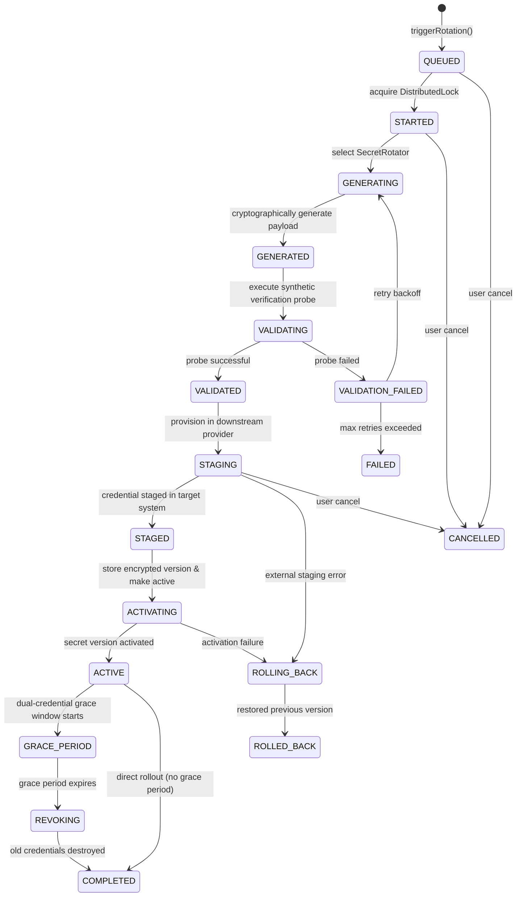

# Architecture & State Machine: Secret Rotation Engine

## 1. Overview

The SecretVault Rotation Engine orchestrates the automated replacement of secret credentials across diverse infrastructure targets with zero downtime, formal safety invariants, and cryptographic guarantees.

---

## 2. 21-State Rotation Machine

Every rotation job transitions through an explicit state machine managed by `RotationService`:

### Complete State Descriptions

1. **QUEUED**: Rotation job created and stored in Postgres. Awaiting worker pickup or synchronous pipeline execution.
2. **STARTED**: Distributed lock acquired on `secret_id` using `RotationDistributedLock` (Redis or DB lease).
3. **GENERATING**: `SecretRotator` invoked to generate secure candidate credential bytes.
4. **GENERATED**: Candidate credential created in memory.
5. **VALIDATING**: Synthetic verification probes initiated (`RotationValidationEngine`).
6. **VALIDATED**: Candidate successfully validated against synthetic probe or target system.
7. **VALIDATION_FAILED**: Validation test failed (e.g., target API returned HTTP 401).
8. **STAGING**: Candidate credential provisioned in target system alongside active credential (dual-credential mode).
9. **STAGED**: Downstream system confirms candidate credential is ready for traffic.
10. **ACTIVATING**: Envelope encryption executed; new `SecretVersion` record persisted; `Secret.currentVersionNumber` incremented.
11. **ACTIVE**: New version is now the authoritative version returned for secrets retrieval and leases.
12. **GRACE_PERIOD**: Dual-credential grace timer started. Microservices continue using old version while fetching new version via SDK.
13. **REVOKING**: Grace timer elapsed. Downstream rotator instructed to deprovision and invalidate old credential.
14. **COMPLETED**: Rotation workflow finished successfully with full audit trail.
15. **ROLLING_BACK**: Failure occurred during staging or activation; rollback handler invoked.
16. **ROLLED_BACK**: Target version reverted, old credential restored as primary, and job marked as rolled back.
17. **CANCELLED**: Operator aborted rotation job prior to activation.
18. **FAILED**: Terminal error during execution with failure diagnostic recorded in job entity.

---

## 3. Distributed Locking & Concurrency Protection

Secret rotation involves mutating sensitive remote resources (database users, OAuth credentials, cloud IAM keys). Simultaneous rotations on the same secret will lead to split-brain states or credential corruption.

### `RotationDistributedLock`

The system uses a non-reentrant distributed lock:
- Lock key: `sv:lock:rotation:<secret_id>`
- Default TTL: 5 minutes (300 seconds)
- Lock token: UUID generated per execution thread
- Guarantee: Only one rotation or rollback job can execute per `secret_id` at any time across cluster nodes.

---

## 4. Cryptographic Envelope Storage

When a new credential passes validation:
1. `SecretGenerationEngine` produces high-entropy plaintext in memory.
2. `EncryptionService.encrypt(plaintextBytes, aad)` wraps the plaintext with AES-256-GCM and a unique Data Encryption Key (DEK).
3. Plaintext memory buffers are immediately zeroized.
4. The encrypted payload (ciphertext, wrapped DEK, IV, auth tag, KEK reference) is saved in the immutable `secret_versions` table.
5. `Secret.currentVersionNumber` is updated atomically.
