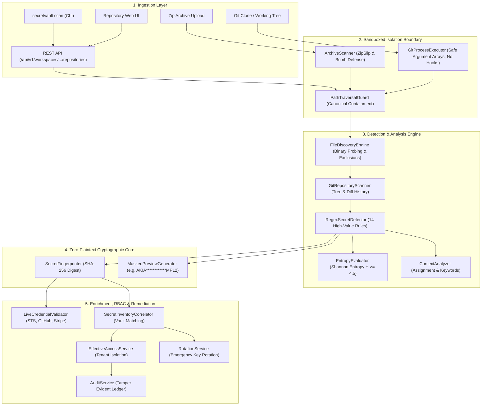
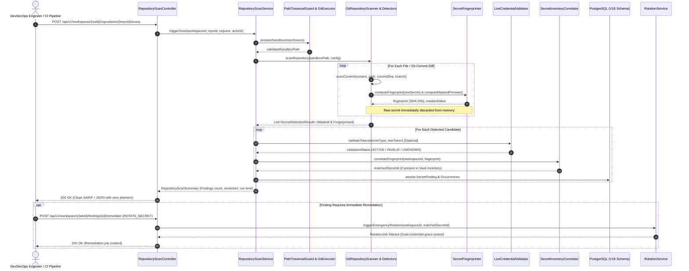

# Phase 12 Architecture: Repository Security & Secret Leak Detection

## 1. High-Level System Overview

The SecretVault Repository Security subsystem provides automated detection, triage, live validation, cryptographic inventory correlation, and zero-downtime remediation for leaked credentials.

It is designed around four foundational architectural pillars:
1. **Isolated Sandboxing**: Scans occur strictly inside contained filesystem sandboxes with zero arbitrary shell execution.
2. **Multi-Signal Detection**: Combines bounded deterministic regex matching, Shannon entropy quantification, and keyword contextual scoring.
3. **Zero-Plaintext Invariant**: Scanner components, persistence layers, REST controllers, and audit trails never persist or transmit raw plaintext secrets.
4. **Actionable Remediation**: Findings are directly wired into SecretVault's Phase 12 Rotation Engine for immediate automated or manual key rotation and credential revocation.

---

## 2. Component Architecture Diagram

---

## 3. Sequence Flow: End-to-End Scan & Remediation

---

## 4. Multi-Tenancy & Workspace Scoping

All repository entities, scans, findings, allowlists, and remediation jobs are explicitly scoped by `workspace_id`. Cross-workspace scanning or finding retrieval is strictly prohibited at both the database query layer (JPA composite keys and constraints) and the business logic layer (`EffectiveAccessService.requireWorkspacePermission`).

| Permission | Scope | Allowed Actions |
| :--- | :--- | :--- |
| `REPOSITORY_VIEW` | Workspace | View repository list, scan history, masked findings, "Why Exposed" |
| `REPOSITORY_SCAN` | Workspace | Initiate scans, upload archives for scanning |
| `REPOSITORY_MANAGE` | Workspace | Connect repositories, update policies, configure Webhooks |
| `REPOSITORY_FINDING_MANAGE` | Workspace | Triage findings, mark false positives, manage allowlists |
| `REPOSITORY_REMEDIATE` | Workspace | Trigger emergency secret rotation, credential revocation |
