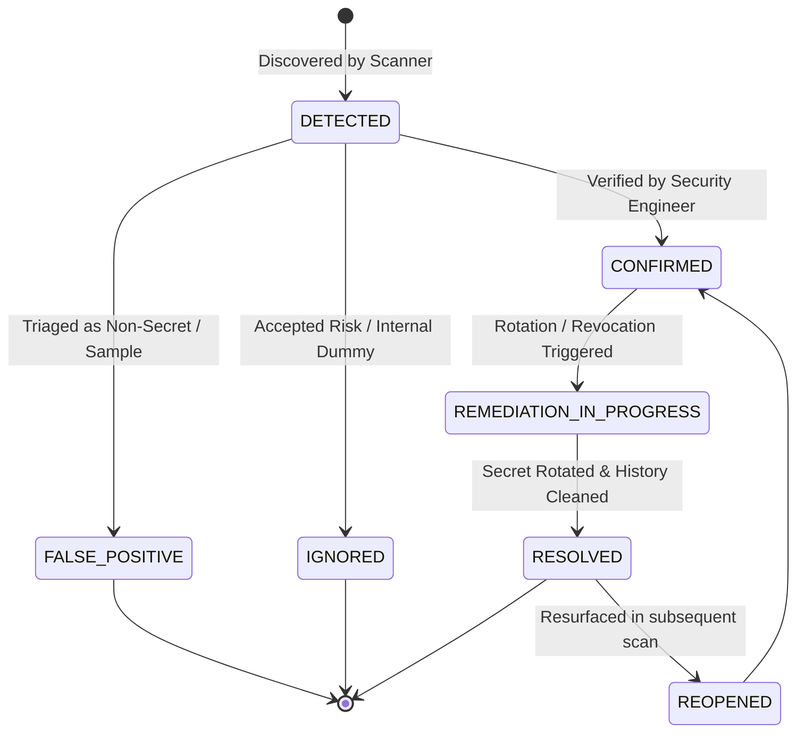

# Phase 12: Findings Lifecycle, Severity & Triage

## 1. Overview

Each detected secret generates or updates a `SecretFinding` record in the database, tracking its discovery location, validation status, occurrence history, and remediation path.

---

## 2. Finding Lifecycle State Machine

---

## 3. Severity & Confidence Matrix

Findings are classified into five severity tiers based on credential blast radius:

| Severity | Credential Types | Example |
| :--- | :--- | :--- |
| `CRITICAL` | Root credentials, cloud provider master keys, payment processing keys, unencrypted private keys, production database connection URIs | AWS Root Key, Stripe Live Secret Key, RSA Private Key |
| `HIGH` | Scoped API tokens, third-party service tokens, active user session tokens | SendGrid Key, Slack Bot Token, Twilio Auth Token |
| `MEDIUM` | Short-lived OAuth tokens, JWTs without verified secrets, generic high-entropy strings in production paths | JWT access token, webhook secret |
| `LOW` | Credentials in known test directories, mock fixtures, documentation samples | Sample API key in `README.md` or `tests/mocks/` |
| `INFO` | Low-entropy tokens, public identifiers, non-sensitive configuration keys | Public AWS Key ARN, Client ID |

---

## 4. The "Why Exposed?" Explainability Engine

To help developers understand the risk immediately, `SecretFindingService.generateWhyExposed` synthesizes:
- **Repository Visibility**: Identifies if the repo is `PUBLIC` or `INTERNAL`.
- **Vault Correlation**: Confirms if the secret is actively managed in SecretVault.
- **Provider Status**: Indicates whether live validation succeeded (`ACTIVE`).
- **Persistence**: Distinguishes between working tree edits vs. permanent Git commits.
- **Recommended Remediation**: Provides a tailored remediation plan based on severity and secret type.
