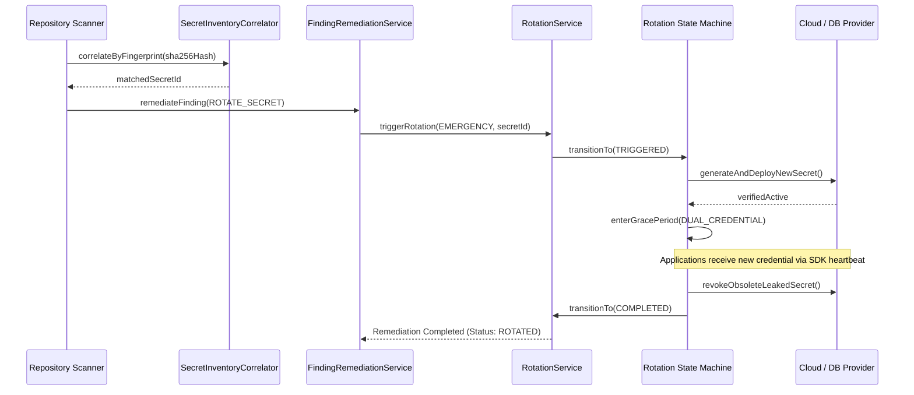

# Phase 12: Rotation Engine Integration & Compromise Cascade

## 1. Overview

SecretVault uniquely unifies repository secret scanning with its built-in enterprise rotation engine. Leaked credentials can trigger automated, zero-downtime key rotation directly from the repository finding interface or CI pipeline.

---

## 2. Integration Architecture

---

## 3. Zero-Downtime Dual-Credential Grace Period

When emergency rotation is triggered due to a public leak:
1. The new credential is generated and activated on the provider alongside the compromised credential.
2. Applications querying SecretVault via SDK (`@VaultSecret`, `secretvault-sdk-core`) or runtime agents automatically receive the new credential on their next heartbeat interval.
3. The leaked credential is monitored and revoked only after all active consumers have reported successful migration (or upon expiration of the emergency grace period timer).
4. The repository finding is updated to `REMEDIATED` with an immutable entry in the workspace audit trail.
